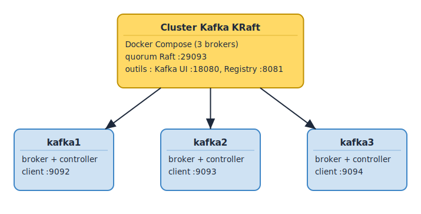

# Lab L1 — Mise en place de l'environnement
**Durée** : 1h
**Stack** : Docker, Docker Compose, Kafka KRaft, Schema Registry, Kafka UI

> **Cours associé** : M5.2 — Lab cluster Kafka local (1ʳᵉ passe), puis M8.1 — Self-managed Kafka et M8.3 — Lab cluster 3 brokers (2ᵉ passe avec angle ops/prod). Index du module : README B1-M06.

## Objectifs

- Démarrer un cluster Kafka local à 3 brokers en mode KRaft (sans ZooKeeper).
- Vérifier que les brokers se sont correctement formés en quorum et que Schema Registry est joignable.
- Manipuler la CLI Kafka pour créer un premier topic et échanger des messages avec `kafka-console-producer` et `kafka-console-consumer`.
- Explorer Kafka UI pour visualiser brokers, topics, consumer groups et schémas.
- Installer le Makefile commun aux 8 labs et ses cibles utilitaires.

## Prérequis

- Docker Engine **24+** et Docker Compose **v2** (`docker compose version`).
- 8 Go de RAM libre minimum, 4 cœurs CPU recommandés.
- Ports libres pour L1 : `9092 9093 9094` (Kafka EXTERNAL), `18080` (Kafka UI), `8081` (Schema Registry). Les labs suivants ouvriront d'autres ports (Connect, MinIO, Spark, Grafana, etc.).
- `make`, `curl`, `jq` installés sur la machine hôte.
- Cloner le repo `formation-kafka` et se placer dans `labs/L1-setup`.

## Architecture

<!-- mermaid-source
%%{init: {'theme':'base', 'themeVariables': {'primaryColor':'#1F2937','primaryTextColor':'#F9FAFB','primaryBorderColor':'#374151','lineColor':'#6366F1','fontFamily':'Inter, system-ui, sans-serif','fontSize':'14px'}}}%%
flowchart LR
    DEV[CLI / scripts<br/>hôte] --&gt;|9092 9093 9094| K1
    DEV --&gt;|18080| UI[Kafka UI]
    DEV --&gt;|8081| SR[Schema Registry]

        K1[kafka1<br/>broker + controller]
        K2[kafka2<br/>broker + controller]
        K3[kafka3<br/>broker + controller]
        K1 <--&gt;|quorum :29093| K2
        K2 <--&gt;|quorum :29093| K3
        K1 <--&gt;|quorum :29093| K3
    CLUSTER["Cluster Kafka KRaft"]


    UI --&gt; K1
    SR --&gt; K1
    SR --&gt; K2
    SR --&gt; K3

    class K1,K2,K3 kafka
    class SR registry
    class UI compute
    class DEV source
    classDef kafka fill:#0EAA47,stroke:#0E7C32,color:#fff,stroke-width:2px
    classDef registry fill:#F59E0B,stroke:#B45309,color:#fff,stroke-width:2px
    classDef compute fill:#EC4899,stroke:#BE185D,color:#fff,stroke-width:2px
    classDef source fill:#3B82F6,stroke:#1E40AF,color:#fff,stroke-width:2px
-->

[Source Excalidraw](../../figures/L1/01.excalidraw)

## Étape 1 — Démarrer le cluster

Ce lab utilise un `docker-compose.yml` **local** au dossier `labs/L1-setup/`, volontairement minimal (3 brokers KRaft + Schema Registry + Kafka UI) pour se concentrer sur les fondamentaux sans le bruit des services des labs suivants. Tout est self-contained, aucune dépendance externe à `docker/` à la racine.

```bash
cd labs/L1-setup
make up
```

La cible `up` exécute `docker compose -f docker-compose.yml up -d` (≈ 30 s, juste le pull des images `confluentinc/cp-kafka`, `cp-schema-registry` et `provectuslabs/kafka-ui` au premier lancement).

> **Passage à L2+** : à partir du lab 2 nous basculerons sur le compose **complet** de la racine (`docker/docker-compose.yml`) qui ajoute Connect, Postgres, MinIO, Spark, Prometheus, Grafana et DuckDB. Avant de passer à L2, faites un `make down` ici pour libérer les ports.

Suivre les logs jusqu'à ce que les 3 brokers soient `healthy` :

```bash
make logs
```

## Étape 2 — Vérifier les brokers

```bash
# Health check via le Makefile
make health
```

Sortie attendue :

```
kafka1   running   healthy
kafka2   running   healthy
kafka3   running   healthy
schema-registry   running
kafka-ui          running
```

Vérifier le quorum KRaft directement dans le broker `kafka1` :

```bash
docker exec -e KAFKA_OPTS= kafka1 kafka-metadata-quorum --bootstrap-server localhost:29092 describe --status
```

Tu dois voir `LeaderId`, `LeaderEpoch`, et 3 voters actifs (`1, 2, 3`).

Vérifier Schema Registry :

```bash
curl -s http://localhost:8081/subjects | jq .
# -> [] (aucun schéma encore enregistré)
```

### Check visuel — Kafka UI

Ouvrir Kafka UI : <http://localhost:18080>

Sélectionner le cluster `formation-kafka` et vérifier que les 3 brokers apparaissent en ligne.

Screenshot recommandé pour votre suivi :

| Nom | Outil | Validation attendue |
|---|---|---|
| `01-kafka-ui-brokers.png` | Kafka UI | les 3 brokers Kafka sont visibles, status `online` |

> L'observabilité (Prometheus + Grafana, dashboard *Kafka Learning Dashboard*) est ajoutée au compose complet et couverte en détail dans **L8 — Ops & Sécurité**.

## Étape 3 — Créer un topic

Créer un topic `events.demo` à 3 partitions, RF=3, `min.insync.replicas=2` :

```bash
docker exec -e KAFKA_OPTS= kafka1 kafka-topics \
  --bootstrap-server kafka1:29092 \
  --create \
  --topic events.demo \
  --partitions 3 \
  --replication-factor 3 \
  --config min.insync.replicas=2
```

Lister les topics :

```bash
make topics-list
```

Décrire le topic (leader, ISR, replicas) :

```bash
docker exec -e KAFKA_OPTS= kafka1 kafka-topics \
  --bootstrap-server kafka1:29092 \
  --describe --topic events.demo
```

Vérifier que chaque partition a bien 3 ISR (`Isr: 1,2,3` ou un ordre équivalent).

## Étape 4 — Tester avec kafka-console-producer/consumer

Dans un premier terminal, démarrer un consumer sur la totalité des partitions :

```bash
docker exec -it -e KAFKA_OPTS= kafka1 kafka-console-consumer \
  --bootstrap-server kafka1:29092 \
  --topic events.demo \
  --from-beginning \
  --property print.key=true \
  --property key.separator=" | "
```

Dans un second terminal, produire quelques messages clé/valeur :

```bash
docker exec -it -e KAFKA_OPTS= kafka1 kafka-console-producer \
  --bootstrap-server kafka1:29092 \
  --topic events.demo \
  --property parse.key=true \
  --property key.separator=":"
```

Saisir, ligne par ligne :

```
user-1:{"event":"login","ts":1}
user-2:{"event":"signup","ts":2}
user-1:{"event":"logout","ts":3}
```

Le consumer doit afficher les 3 messages. La même clé (`user-1`) atterrit toujours sur la même partition — c'est la base de l'**ordering par clé** que nous exploiterons dans les labs L2 (Producers).

Tester maintenant la durabilité : arrêter `kafka2` et vérifier que la production reste possible (avec `acks=all` et `min.insync.replicas=2`, il reste 2 ISR sur 3, le quorum est respecté) :

```bash
docker stop kafka2
# Reproduire un message dans le producer ouvert : doit fonctionner
docker start kafka2
# kafka2 rejoint l'ISR au bout de quelques secondes
```

## Étape 5 — Explorer Kafka UI

Ouvrir [http://localhost:18080](http://localhost:18080) dans un navigateur.

Cliquer sur le cluster `formation-kafka` puis explorer :

1. **Brokers** — liste des 3 brokers, leur ID, leur statut (online), leur rôle (broker + controller).
2. **Topics** — voir `events.demo` et les topics internes (`__consumer_offsets`, `_schemas`).
3. **Topic events.demo** — onglet *Messages* pour relire les messages produits, onglet *Settings* pour voir la configuration (RF, partitions, retention).
4. **Schema Registry** — onglet dédié, encore vide pour l'instant. Sera utilisé dans le Lab L3.
5. **Consumer Groups** — vide tant qu'aucun consumer applicatif n'a été démarré (le `console-consumer` utilise un groupe éphémère).

## Validation

- [ ] 3 brokers `healthy` et présents dans l'ISR de tous les topics
- [ ] Schema Registry accessible sur `http://localhost:8081/subjects`
- [ ] Topic `events.demo` créé visible dans Kafka UI
- [ ] 3 messages produits relus depuis le topic via `kafka-console-consumer`
- [ ] Un broker peut être arrêté/redémarré sans perte de message (cluster tolère 1 panne)
- [ ] `make health` retourne vert pour tous les services

## Pour aller plus loin

- Modifier la **rétention** d'un topic à 1 minute et observer la suppression automatique des segments (`retention.ms=60000`).
- Activer **compression** côté producer (`compression.type=zstd`) et comparer la taille du segment sur disque (`docker exec kafka1 du -sh /var/lib/kafka/data/events.demo-0`).
- Lancer `kafka-producer-perf-test` pour mesurer le débit local (10k msg/s sur un laptop standard sans optimisation).
- Lire le KIP-500 pour comprendre la motivation derrière KRaft (suppression de ZooKeeper, performances du metadata log, simplification opérationnelle).
- Inspecter le metadata topic interne `__cluster_metadata` (read-only, géré par les controllers).

## Dépannage

| Symptôme | Diagnostic | Action |
|---|---|---|
| `kafka1` reste `starting` plus de 2 min | Conflit de port `9092` | `lsof -i :9092` puis tuer le process ou changer le mapping |
| Erreur `Connection refused` sur `localhost:9092` | Le listener EXTERNAL pointe sur `localhost`, le client ne tourne pas sur l'hôte | Utiliser `kafka1:29092` depuis un autre conteneur, `localhost:9092` depuis l'hôte |
| Schema Registry crash-loop | `kafka1` pas encore healthy | Attendre, ou `make down && make up` |
| Build de `connect` échoue (timeout `confluent-hub`) | Réseau lent | Relancer `docker compose build connect` |
| Volumes corrompus après crash | Cluster ID divergent entre brokers | `docker compose down -v` puis `make up` |
| `make` introuvable | Pas de make sur la machine | Sur Ubuntu : `sudo apt install make` ; sinon copier les commandes du Makefile à la main |

À l'issue de ce lab, l'environnement est opérationnel pour le **Lab L2 — Producers et Consumers**.
