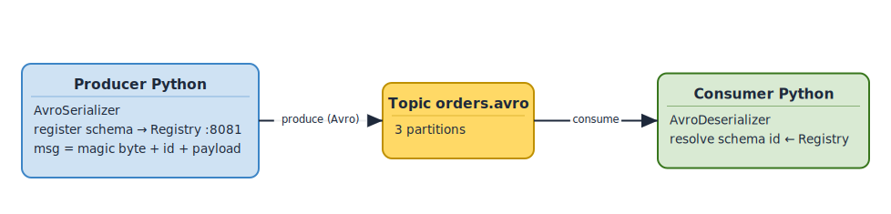
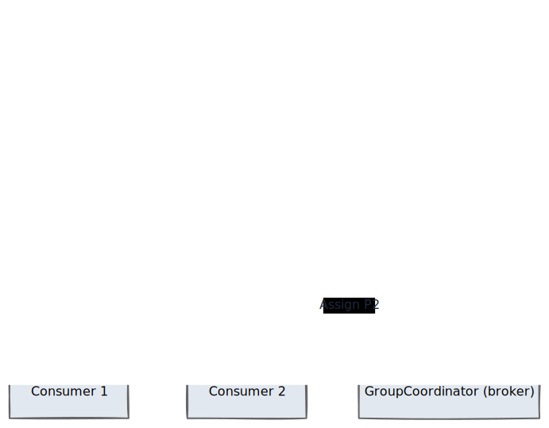

# Lab L2 — Producers & Consumers Python avec Avro
**Durée** : 2h
**Stack** : Python 3.10+, confluent-kafka, fastavro, Schema Registry

> **Cours associé** : M5.4 (producer), M5.6 (consumer), M6.2 (Schema Registry) et M6.3 (lab Avro). Les extraits de code de ces sections sont adaptés de ce lab.
> **Paire bilingue** : [L3-scala-producers-consumers](../../labs/L3-scala-producers-consumers/lab.md) — même contenu en Scala. Faire **L2 ou L3** selon le langage cible (L2 = défaut pédagogique).

## Objectifs
- Implémenter un producer Python avec sérialisation Avro
- Implémenter un consumer avec consumer group, gestion d'offsets
- Comprendre acks, idempotence, retry, deserialization errors
- Évoluer un schéma Avro (compatibilité backward)

## Prérequis
- L1 terminé (cluster up)
- Python 3.10+, pip
- `pip install confluent-kafka[avro] fastavro requests`

Vérifier que l'infra Docker est démarrée :

```bash
docker compose ps
curl -s http://localhost:8081/subjects   # Schema Registry doit répondre []
```

Variables d'environnement utilisées par les scripts :

| Variable             | Défaut                                   |
|----------------------|------------------------------------------|
| `BOOTSTRAP_SERVERS`  | `localhost:9092,localhost:9093,localhost:9094` |
| `SCHEMA_REGISTRY_URL`| `http://localhost:8081`                  |

## Architecture

Flux global du lab : un producer Python sérialise des objets `Order` au format Avro, publie sur le topic `orders.avro`, et un consumer désérialise via le Schema Registry.

<!-- mermaid-source
%%{init: {'theme':'base', 'themeVariables': {'primaryColor':'#1F2937','primaryTextColor':'#F9FAFB','primaryBorderColor':'#374151','lineColor':'#6366F1','fontFamily':'Inter, system-ui, sans-serif','fontSize':'14px'}}}%%
flowchart LR
    P[Producer Python<br/>AvroSerializer] --&gt;|"1 Get/Register schema id"| SR[Schema Registry<br/>:8081]
    P --&gt;|"2 Produce magic byte + id + payload"| K[("orders.avro<br/>3 partitions")]
    K --&gt;|"3 Fetch records"| C[Consumer Python<br/>AvroDeserializer]
    C --&gt;|"4 Resolve schema by id"| SR
    SR -.cache.-> P
    SR -.cache.-> C

    class P,C compute
    class K kafka
    class SR registry
    classDef kafka fill:#0EAA47,stroke:#0E7C32,color:#fff,stroke-width:2px
    classDef source fill:#3B82F6,stroke:#1E40AF,color:#fff,stroke-width:2px
    classDef sink fill:#A855F7,stroke:#7E22CE,color:#fff,stroke-width:2px
    classDef registry fill:#F97316,stroke:#C2410C,color:#fff,stroke-width:2px
    classDef compute fill:#EC4899,stroke:#BE185D,color:#fff,stroke-width:2px
    classDef storage fill:#06B6D4,stroke:#0E7490,color:#fff,stroke-width:2px
-->

[Source Excalidraw](../../figures/L2/01.excalidraw)

## Étape 1 — Topic et schéma Avro

Créer le topic `orders.avro` (3 partitions, RF=3) :

```bash
docker exec -it -e KAFKA_OPTS= kafka1 kafka-topics \
  --bootstrap-server kafka1:29092 \
  --create --topic orders.avro \
  --partitions 3 --replication-factor 3
```

Vérifier :

```bash
docker exec -it -e KAFKA_OPTS= kafka1 kafka-topics \
  --bootstrap-server kafka1:29092 \
  --describe --topic orders.avro
```

Ouvrir `schemas/order_v1.avsc` et lire le schéma. Points clés :
- `namespace` permet d'éviter les collisions de noms.
- Chaque champ a un `type` et optionnellement une `doc`.
- `created_at` utilise un *logical type* `timestamp-millis` (encodé en `long`).

## Étape 2 — Producer simple (sans schéma)

Lancer `producer_simple.py` qui sérialise en JSON brut :

```bash
python producer_simple.py
```

Observer dans Kafka UI (`http://localhost:18080`) que les messages arrivent sur le topic `orders.json`.

Limites de cette approche :
- Pas de validation de schéma : un producer peut envoyer n'importe quoi.
- Pas de versioning : les consumers cassent silencieusement.
- Payload plus lourd (JSON est verbeux).

C'est exactement ce que résout Avro + Schema Registry.

## Étape 3 — Producer avec Avro + Schema Registry

Le producer Avro fait deux choses supplémentaires :
1. Au premier message, il enregistre le schéma auprès du Schema Registry et reçoit un `schema id`.
2. Chaque message est encodé : `[magic byte 0x00] + [schema id sur 4 octets] + [payload Avro binaire]` (format wire de Confluent).

Compléter `producer_avro.py` (zones `TODO`) :

```python
# Configuration du Schema Registry
schema_registry_conf = {"url": SCHEMA_REGISTRY_URL}
schema_registry_client = SchemaRegistryClient(schema_registry_conf)

# Lire le schéma depuis le fichier
with open("schemas/order_v1.avsc") as f:
    schema_str = f.read()

avro_serializer = AvroSerializer(
    schema_registry_client=schema_registry_client,
    schema_str=schema_str,
    to_dict=order_to_dict,  # convertit objet Python → dict Avro
)
```

Lancer :

```bash
python producer_avro.py
```

Vérifier que le sujet est bien créé :

```bash
curl -s http://localhost:8081/subjects | jq
curl -s http://localhost:8081/subjects/orders.avro-value/versions/latest | jq
```

### Check visuel — topic, schéma, débit

Ouvrir :

- Kafka UI : <http://localhost:18080>
- Grafana : <http://localhost:13000>, dashboard **Kafka Learning Dashboard**

À vérifier :

| Screenshot | Outil | Validation attendue |
|---|---|---|
| `03-topic-orders-events.png` | Kafka UI | le topic `orders.avro` contient des messages |
| `05-messages-in-rate.png` | Grafana | le panel `Messages produits par broker` montre un pic pendant le producer |
| `06-schema-registry-ordercreated.png` | Kafka UI ou Schema Registry | le sujet `orders.avro-value` existe avec au moins une version |

L'objectif est de relier une commande Python (`python producer_avro.py`) à une preuve visuelle : message dans Kafka, schéma enregistré, métrique de débit qui bouge.

## Étape 4 — Consumer Avro

Le consumer fait l'opération inverse :
1. Lit `magic byte + schema id` du payload.
2. Récupère le schéma depuis le Schema Registry (avec cache).
3. Décode le binaire Avro en dict Python.

Lancer dans un autre terminal :

```bash
python consumer_avro.py
```

Points pédagogiques à observer dans le code :
- `group.id` : identifie le consumer group, Kafka mémorise l'offset par group/partition.
- `auto.offset.reset=earliest` : quand le group n'existe pas encore, repartir du début (`latest` ignorerait les messages produits avant).
- `enable.auto.commit=False` : on commit explicitement après traitement (at-least-once propre).

## Étape 5 — Consumer group : démos rebalance avec 2 instances

Garder le consumer du step 4 ouvert. Dans **un second terminal**, lancer la même commande :

```bash
python consumer_group_demo.py
```

Les deux instances partagent le `group.id`. Kafka déclenche un *rebalance* :
- Avec une seule instance, elle lit les 3 partitions.
- Avec deux instances, chacune se voit assigner ~1.5 partition (en pratique 2 et 1).

Dans Kafka UI, ouvrir **Consumer Groups** et observer le group utilisé par le script. Screenshot recommandé : `04-consumer-group-offsets.png`. Le point important est de voir les offsets avancer et le lag revenir à 0 quand le consumer a rattrapé le topic.

Diagramme de séquence du rebalance :

<!-- mermaid-source
%%{init: {'theme':'base', 'themeVariables': {'primaryColor':'#1F2937','primaryTextColor':'#F9FAFB','primaryBorderColor':'#374151','lineColor':'#6366F1','fontFamily':'Inter, system-ui, sans-serif','fontSize':'14px'}}}%%
sequenceDiagram
    participant C1 as Consumer 1
    participant C2 as Consumer 2
    participant GC as GroupCoordinator (broker)
    Note over C1,GC: État initial : C1 seul, possède P0, P1, P2
    C2->>GC: JoinGroup(group=demo)
    GC->>C1: Rebalance: revoke partitions
    C1->>GC: Commit offsets en cours
    GC->>C1: Assign P0, P1
    GC->>C2: Assign P2
    Note over C1,C2: Reprise du fetch sur les nouvelles partitions
-->

[Source Excalidraw](../../figures/L2/02.excalidraw)

Lancer `producer_avro.py` à nouveau pour observer la répartition dans les logs.

Tuer une des deux instances (Ctrl+C) → un nouveau rebalance redonne les 3 partitions à la survivante.

## Étape 6 — Idempotence et acks=all

Comparer les configs :

| Paramètre                   | Effet                                                            |
|-----------------------------|------------------------------------------------------------------|
| `acks=0`                    | Fire-and-forget. Aucune garantie, pertes possibles.              |
| `acks=1`                    | Le leader confirme. Perte si le leader crashe avant réplication. |
| `acks=all`                  | Tous les ISR confirment. Durabilité maximale.                    |
| `enable.idempotence=true`   | Producer ID + sequence number → pas de doublons sur retry.       |
| `max.in.flight.requests=5`  | Compatible avec idempotence (≤ 5).                               |
| `retries=2147483647`        | Default avec idempotence : retry "infini" + delivery.timeout.ms. |

Modifier `producer_avro.py` pour activer l'idempotence (déjà préparé en commentaire), et discuter en groupe : *quels cas d'erreur étaient possibles avant ?* (doublons sur retry réseau).

## Étape 7 — Évolution de schéma (ajouter un champ optionnel)

Règle de compatibilité par défaut du Schema Registry : `BACKWARD` → un consumer avec le **nouveau** schéma peut lire les messages produits avec l'**ancien**.

Pour respecter `BACKWARD`, on ajoute un champ avec un `default` :

```json
{
  "name": "discount_code",
  "type": ["null", "string"],
  "default": null,
  "doc": "Code promo optionnel, ajouté en v2"
}
```

Tester la compatibilité :

```bash
curl -X POST -H "Content-Type: application/vnd.schemaregistry.v1+json" \
  --data @<(jq -Rs '{schema: .}' schemas/order_v2.avsc) \
  http://localhost:8081/compatibility/subjects/orders.avro-value/versions/latest
```

Doit retourner `{"is_compatible":true}`.

Enregistrer la v2 :

```bash
curl -X POST -H "Content-Type: application/vnd.schemaregistry.v1+json" \
  --data @<(jq -Rs '{schema: .}' schemas/order_v2.avsc) \
  http://localhost:8081/subjects/orders.avro-value/versions
```

Produire avec v2 et consommer avec un consumer encore en v1 → ça marche, le champ ajouté est ignoré.

## Validation

- [ ] Topic `orders.avro` créé avec 3 partitions et RF=3
- [ ] Schéma `orders.avro-value` enregistré (version 1) au Schema Registry
- [ ] `producer_avro.py` produit 20 messages sans erreur
- [ ] `consumer_avro.py` consomme et affiche les 20 ordres désérialisés
- [ ] Rebalance observé en lançant 2 instances dans le même group
- [ ] Schéma v2 enregistré, compatibility `BACKWARD` validée

## Pour aller plus loin (challenge)

1. **Producer transactionnel** : ouvrir `solutions/.../producer_idempotent.py`, activer `transactional.id` et envelopper la boucle dans `begin_transaction()` / `commit_transaction()`.
2. **DLQ** : ouvrir `solutions/.../consumer_with_dlq.py`. Injecter un message volontairement corrompu dans `orders.avro` via `kafka-console-producer`, et observer le routage vers `orders.avro.dlq`.
3. **FORWARD vs FULL** : changer la compatibilité du sujet en `FORWARD`, puis tenter de retirer un champ. Comparer les comportements.

## Dépannage

| Symptôme                                                  | Cause probable                                                       | Solution                                                                  |
|-----------------------------------------------------------|----------------------------------------------------------------------|---------------------------------------------------------------------------|
| `KafkaError{code=_TRANSPORT}` au démarrage                | Brokers non joignables                                               | Vérifier `docker compose ps` et le port 9092                              |
| `SchemaRegistryError: Subject not found`                  | Le producer n'a jamais publié de schéma                              | Lancer le producer avant le consumer                                      |
| `Incompatible schema`                                     | Le nouveau schéma viole la règle BACKWARD                            | Ajouter un `default` au nouveau champ ou changer la compatibilité         |
| Consumer reste bloqué sans logs                           | `auto.offset.reset=latest` et aucun message produit après le start   | Mettre `earliest` ou produire de nouveaux messages                        |
| `MessageDeserializationError`                             | Message non Avro publié sur le topic                                 | Vérifier que tous les producers utilisent l'AvroSerializer, ou utiliser une DLQ |
| Rebalance permanent                                       | `session.timeout.ms` trop bas vs charge de traitement                | Augmenter `max.poll.interval.ms` ou réduire `max.poll.records`            |
