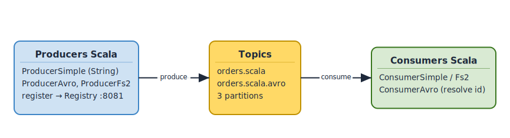
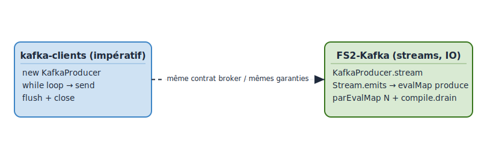

# Lab L3 — Producers & Consumers Scala
**Durée** : 2h
**Stack** : Scala 2.13 (ou 3.x), sbt 1.10, kafka-clients 3.7, FS2-Kafka 3.5, Avro4s 4.x, Confluent Schema Registry 7.6

> **Cours associé** : M5.4, M5.6, M6.2, M6.3 — variante Scala du parcours producer/consumer/Avro.
> **Paire bilingue** : [L2-python-producers-consumers](../../labs/L2-python-producers-consumers/lab.md) — même contenu en Python. Faire **L2 ou L3** selon le langage cible (L3 = parcours JVM).

## Objectifs

À l'issue de ce lab l'apprenant sera capable de :

- Implémenter un Producer/Consumer Kafka idiomatique en Scala avec sérialisation typée.
- Comparer les approches **impérative** (`kafka-clients`) et **fonctionnelle / streams** (FS2-Kafka, cats-effect).
- Sérialiser des `case class` en Avro via Avro4s + Confluent Schema Registry.
- Configurer un consumer group, l'idempotence producer, et toucher au modèle exactly-once (transactions, *consume-process-produce*).
- Décider quelle approche (impérative vs streams) appliquer dans un contexte Spark / Flink / micro-services.

## Prérequis

- L1 terminé : cluster Docker `up` (3 brokers + Schema Registry + Kafka UI).
- L2 fortement recommandé (Avro côté Python, mêmes concepts revus côté Scala).
- JDK 17 + sbt 1.10 (`sbt --version` doit fonctionner).
- Vérifications rapides :

```bash
docker compose ps
curl -s http://localhost:8081/subjects   # Schema Registry doit répondre
sbt --version                            # >= 1.10.x
java -version                            # >= 17
```

Variables d'environnement utilisées par le code Scala (avec valeurs par défaut) :

| Variable               | Défaut                                         |
|------------------------|------------------------------------------------|
| `BOOTSTRAP_SERVERS`    | `localhost:9092,localhost:9093,localhost:9094` |
| `SCHEMA_REGISTRY_URL`  | `http://localhost:8081`                        |
| `TOPIC`                | `orders.scala`                                 |
| `TOPIC_AVRO`           | `orders.scala.avro`                            |
| `GROUP_ID`             | `scala-consumer`                               |

## Architecture

Le lab manipule deux topics et compare deux styles de code :

- **Style impératif** (`kafka-clients`) : `KafkaProducer` / `KafkaConsumer`, `poll`, `commitSync`. Familier des devs Java.
- **Style fonctionnel** (`FS2-Kafka`) : `Stream[F, *]`, `Resource`, back-pressure native, composabilité.

<!-- mermaid-source
%%{init: {'theme':'base', 'themeVariables': {'primaryColor':'#1F2937','primaryTextColor':'#F9FAFB','primaryBorderColor':'#374151','lineColor':'#6366F1','fontFamily':'Inter, system-ui, sans-serif','fontSize':'14px'}}}%%
flowchart LR
        PI[ProducerSimple<br/>kafka-clients]
        PF[ProducerFs2<br/>FS2-Kafka]
        PA[ProducerAvro<br/>Avro4s]
    App["Application Scala"]

    PI --&gt;|String,String| TS[("orders.scala<br/>3 partitions")]
    PF --&gt;|String,String| TS
    PA --&gt;|"magic byte + schema id + Avro"| TA[("orders.scala.avro<br/>3 partitions")]
    PA -.->|register schema| SR[Schema Registry<br/>:8081]
    TA --&gt; CA[ConsumerAvro<br/>Avro4s]
    TS --&gt; CI[ConsumerSimple]
    TS --&gt; CF[ConsumerFs2]
    CA -.->|fetch schema by id| SR

    class PI,PF,PA,CI,CF,CA compute
    class TS,TA kafka
    class SR registry
    classDef kafka fill:#0EAA47,stroke:#0E7C32,color:#fff,stroke-width:2px
    classDef source fill:#3B82F6,stroke:#1E40AF,color:#fff,stroke-width:2px
    classDef sink fill:#A855F7,stroke:#7E22CE,color:#fff,stroke-width:2px
    classDef registry fill:#F97316,stroke:#C2410C,color:#fff,stroke-width:2px
    classDef compute fill:#EC4899,stroke:#BE185D,color:#fff,stroke-width:2px
    classDef storage fill:#06B6D4,stroke:#0E7490,color:#fff,stroke-width:2px
-->

[Source Excalidraw](../../figures/L3/01.excalidraw)

Comparaison **API impérative** vs **streaming fonctionnel** sur la même charge :

<!-- mermaid-source
%%{init: {'theme':'base', 'themeVariables': {'primaryColor':'#1F2937','primaryTextColor':'#F9FAFB','primaryBorderColor':'#374151','lineColor':'#6366F1','fontFamily':'Inter, system-ui, sans-serif','fontSize':'14px'}}}%%
flowchart TB
    subgraph Imperatif["kafka-clients (impératif, blocking)"]
        I1[new KafkaProducer]
        I2["while loop send"]
        I3[producer.flush]
        I4[producer.close]
        I1 --&gt; I2 --&gt; I3 --&gt; I4
    end
    subgraph Stream["FS2-Kafka (streams, IO)"]
        S1["KafkaProducer.stream IO"]
        S2["Stream.emits orders"]
        S3["evalMap producer.produce"]
        S4["parEvalMap N identity"]
        S5["compile.drain"]
        S1 --&gt; S2 --&gt; S3 --&gt; S4 --&gt; S5
    end
    Imperatif -. "même contrat broker<br/>même garanties" .-> Stream

    class I1,I2,I3,I4 source
    class S1,S2,S3,S4,S5 compute
    classDef source fill:#3B82F6,stroke:#1E40AF,color:#fff,stroke-width:2px
    classDef compute fill:#EC4899,stroke:#BE185D,color:#fff,stroke-width:2px
-->

[Source Excalidraw](../../figures/L3/02.excalidraw)

## Étape 1 — Setup du projet sbt

Se placer dans le répertoire du lab :

```bash
cd labs/L3-scala-producers-consumers
sbt update     # télécharge les dépendances
sbt compile
```

Inspecter `build.sbt` :
- `scalaVersion` 2.13.14 (Avro4s 4.x supporte 2.13 et 3.x ; on reste sur 2.13 pour éviter les incompatibilités d'écosystème Big Data — Spark 3.5 est en 2.13).
- Resolver Confluent ajouté pour `kafka-avro-serializer` qui n'est pas sur Maven Central.
- `fork := true` : chaque `runMain` tourne dans une JVM séparée pour éviter les fuites de classpath sbt.

Créer les topics côté broker :

```bash
docker exec -it -e KAFKA_OPTS= kafka1 kafka-topics --bootstrap-server kafka1:29092 \
  --create --topic orders.scala --partitions 3 --replication-factor 3
docker exec -it -e KAFKA_OPTS= kafka1 kafka-topics --bootstrap-server kafka1:29092 \
  --create --topic orders.scala.avro --partitions 3 --replication-factor 3
```

## Étape 2 — Producer impératif (kafka-clients)

Fichier : `src/main/scala/lab/ProducerSimple.scala`.

C'est l'API que tout dev Java reconnaîtra : on instancie un `KafkaProducer[K, V]`, on `send`, on `flush`, on `close`. En Scala on enveloppe la `Properties` Java dans une fonction pure et on utilise `try`/`finally` ou mieux `scala.util.Using`.

Compléter les `TODO` :

```scala
val props = new java.util.Properties()
props.put(BOOTSTRAP_SERVERS_CONFIG, bootstrap)
props.put(KEY_SERIALIZER_CLASS_CONFIG, classOf[StringSerializer].getName)
props.put(VALUE_SERIALIZER_CLASS_CONFIG, classOf[StringSerializer].getName)
props.put(ACKS_CONFIG, "all")
props.put(ENABLE_IDEMPOTENCE_CONFIG, "true")

Using.resource(new KafkaProducer[String, String](props)) { producer =>
  (1 to 20).foreach { i =>
    val record = new ProducerRecord[String, String]("orders.scala", s"key-$i", s"order-$i")
    val md = producer.send(record).get()  // bloquant pour la pédagogie
    println(s"sent partition=${md.partition()} offset=${md.offset()}")
  }
}
```

Lancer :

```bash
sbt "runMain lab.ProducerSimple"
```

## Étape 3 — Consumer impératif

Fichier : `src/main/scala/lab/ConsumerSimple.scala`.

Boucle classique `while (running) { val records = consumer.poll(d); ... ; consumer.commitSync() }`. Points pédagogiques :

- `group.id` : identifiant du consumer group (Kafka mémorise l'offset par couple `group/partition`).
- `auto.offset.reset=earliest` : nouveau group → repart du début.
- `enable.auto.commit=false` : on commit explicitement après traitement (at-least-once propre).

```bash
sbt "runMain lab.ConsumerSimple"
```

Dans un autre terminal, relancer le producer pour voir les messages arriver.

## Étape 4 — Producer fonctionnel avec FS2-Kafka

Fichier : `src/main/scala/lab/ProducerFs2.scala`.

FS2-Kafka modélise Kafka comme un *stream* `cats.effect.IO`. Avantages :

- **Resource safety** : `KafkaProducer.stream[IO]` garantit le `close` même en cas d'erreur, sans `try`/`finally`.
- **Back-pressure native** : `parEvalMap(n)` borne la concurrence sans flag à régler.
- **Composabilité** : l'output est un `Stream[IO, *]` qu'on combine avec d'autres flux (HTTP, fichiers, DB).

Squelette :

```scala
import cats.effect.{IO, IOApp}
import fs2.Stream
import fs2.kafka._

object ProducerFs2 extends IOApp.Simple {
  val settings = ProducerSettings[IO, String, String]
    .withBootstrapServers(bootstrap)
    .withAcks(Acks.All)
    .withEnableIdempotence(true)

  val orders = (1 to 20).map(i => ProducerRecord(topic, s"key-$i", s"order-$i"))

  val run: IO[Unit] =
    KafkaProducer.stream(settings).flatMap { producer =>
      Stream.emits(orders)
        .map(ProducerRecords.one(_))
        .evalMap(producer.produce)
        .parEvalMap(10)(identity)         // 10 inflight max
        .evalTap(r => IO.println(s"sent $r"))
    }.compile.drain
}
```

Lancer :

```bash
sbt "runMain lab.ProducerFs2"
```

## Étape 5 — Consumer fonctionnel avec FS2-Kafka

Fichier : `src/main/scala/lab/ConsumerFs2.scala`.

Le consumer FS2 expose un `Stream[IO, CommittableConsumerRecord[IO, K, V]]`. Le commit d'offset est représenté par une valeur (`CommittableOffset`) : on peut donc *batcher* les commits dans la pipeline.

```scala
KafkaConsumer.stream(consumerSettings)
  .subscribeTo(topic)
  .records
  .evalMap { committable =>
    val r = committable.record
    IO.println(s"key=${r.key} value=${r.value} part=${committable.offset.topicPartition.partition}")
      .as(committable.offset)
  }
  .through(commitBatchWithin(500, 5.seconds))   // commit toutes les 500 msgs ou 5s
  .compile.drain
```

Comparer :
- **Impératif** : la boucle de poll et le commit sont mélangés au traitement, le test unitaire est plus difficile.
- **FS2** : chaque opérateur est testable indépendamment (`Stream.emits(records).through(myProcessing)`).

## Étape 6 — Sérialisation Avro typée (case class → Avro)

Fichier : `src/main/scala/lab/model/Order.scala` et `ProducerAvro.scala` / `ConsumerAvro.scala`.

Avro4s génère le schéma Avro à partir du `case class` via macros. On garde le même contrat que le L2 Python (même `namespace`, mêmes champs) pour l'**interop entre langages**.

```scala
import com.sksamuel.avro4s._

@AvroNamespace("fr.formation.kafka.orders")
@AvroDoc("Commande passée par un client. Schéma v1 partagé L2/L3.")
final case class Order(
  @AvroDoc("Identifiant unique (UUID v4).")              id: String,
  @AvroDoc("Identifiant du client.")                     customer_id: String,
  @AvroDoc("Montant total TTC.")                         total: Double,
  @AvroDoc("Code ISO-4217.")                             currency: String,
  @AvroDoc("Timestamp epoch millis.")                    created_at: Long
)
```

Le Serializer/Deserializer combine :
1. Le Confluent `KafkaAvroSerializer` (gère le wire format `[magic byte][schema id][payload]` et le Schema Registry).
2. Une couche Avro4s qui transforme `case class ↔ GenericRecord`.

```scala
val schema: Schema = AvroSchema[Order]
val toRecord: ToRecord[Order] = ToRecord[Order](schema)
val fromRecord: FromRecord[Order] = FromRecord[Order](schema)
```

Lancer :

```bash
sbt "runMain lab.ProducerAvro"
sbt "runMain lab.ConsumerAvro"
```

Vérifier côté Schema Registry :

```bash
curl -s http://localhost:8081/subjects | jq
curl -s http://localhost:8081/subjects/orders.scala.avro-value/versions/latest | jq
```

Le sujet doit être `orders.scala.avro-value` et le schéma doit être identique (au formatage près) à celui généré par Avro4s.

**Interop avec L2** : produire avec le `producer_avro.py` du L2 sur le topic `orders.avro`, puis consommer avec un `ConsumerAvro` Scala configuré sur ce topic. Tant que le `namespace` et le nom du record matchent, ça fonctionne — c'est tout l'intérêt d'un schéma partagé.

## Étape 7 — Comparaison ergonomique Python vs Scala

Reprendre le code du L2 et le confronter au code Scala.

| Critère                         | Python (confluent-kafka)                  | Scala impératif (kafka-clients)             | Scala FS2-Kafka                            |
|---------------------------------|-------------------------------------------|---------------------------------------------|--------------------------------------------|
| Typage des messages             | Dynamique (`dict`)                        | Statique (`case class` + Avro4s)            | Statique (`case class` + Avro4s)           |
| Gestion des ressources          | `try / finally` ou context manager        | `Using.resource` (Scala 2.13+)              | `Resource` / `Stream` (auto-close)         |
| Concurrence / parallélisme      | Threads ou asyncio + `confluent_kafka.Consumer` | Threads JVM, `ExecutorService`         | `parEvalMap`, `Fiber` cats-effect          |
| Back-pressure                   | Manuel (`max.poll.records`)               | Manuel                                       | Native via FS2                             |
| Tests unitaires                 | `pytest` + monkeypatch                    | ScalaTest + EmbeddedKafka                   | ScalaTest + `Stream.emits` (pas de broker) |
| Courbe d'apprentissage          | Faible                                    | Moyenne                                     | Forte (cats-effect)                        |
| Cas d'usage cible               | Scripts ETL, prototypage, glue code       | Services Java legacy, code shared avec Java | Stream-processing, micro-services event-driven |

À retenir :
- **Python** est imbattable pour le prototypage et les pipelines analytiques.
- **Scala impératif** est utile pour interop avec l'écosystème Java existant (Spring, Spark batch).
- **FS2-Kafka** brille dès qu'on fait du *stream-processing* léger, qu'on veut une discipline ressources stricte, et qu'on a déjà cats-effect dans le projet.

## Validation

- [ ] `sbt compile` passe sans warning fatal.
- [ ] Topics `orders.scala` et `orders.scala.avro` créés (3 partitions, RF=3).
- [ ] `ProducerSimple` envoie 20 messages visibles dans Kafka UI.
- [ ] `ConsumerSimple` consomme et logge ces 20 messages.
- [ ] `ProducerFs2` et `ConsumerFs2` font le même travail avec moins de boilerplate.
- [ ] `ProducerAvro` enregistre le schéma `orders.scala.avro-value` au Schema Registry.
- [ ] `ConsumerAvro` désérialise vers une `case class Order` typée.
- [ ] Le schéma Scala (Avro4s) est compatible avec celui du L2 Python (même namespace, mêmes champs).

## Pour aller plus loin (challenge)

1. **Producer transactionnel** (`solutions/.../ProducerTransactional.scala`) : activer `transactional.id`, `initTransactions()`, `beginTransaction()` / `commitTransaction()`. Observer dans Kafka UI un message *uncommitted* qui n'est pas visible avec `isolation.level=read_committed`.
2. **Exactly-once consume-process-produce** (`solutions/.../ExactlyOnceConsumeProcessProduce.scala`) : pattern *read-process-write*, `sendOffsetsToTransaction(consumerGroupMetadata)` pour atomiser commit producer + commit consumer.
3. **Scala 3 + Tagless Final** : ré-écrire `ConsumerFs2` en abstrayant l'effet (`def run[F[_]: Async]: F[Unit]`) au lieu de fixer `IO`. Discuter quand cela vaut le coût.
4. **Test de sérialisation** (`solutions/.../OrderSerdeSpec.scala`) : round-trip `Order → bytes → Order` sans broker, avec `MockSchemaRegistryClient`.

## Dépannage

| Symptôme                                                          | Cause probable                                                  | Solution                                                                |
|-------------------------------------------------------------------|-----------------------------------------------------------------|-------------------------------------------------------------------------|
| `unresolved dependency: io.confluent#kafka-avro-serializer`       | Resolver Confluent absent du `build.sbt`                        | Ajouter `resolvers += "Confluent" at "https://packages.confluent.io/maven/"` |
| `NoClassDefFoundError: org/apache/avro/...`                       | Avro absent du classpath transitif                              | Vérifier la dépendance `avro4s-core` (tire `avro` 1.11.x)               |
| `org.apache.kafka.common.errors.TimeoutException` au démarrage    | Brokers non joignables (mauvais `bootstrap.servers`)            | Tester `localhost:9092` ; si depuis un container, utiliser `kafka1:29092` |
| `Schema being registered is incompatible with an earlier schema`  | Conflit avec un schéma existant côté Registry                   | Changer de subject (`orders.scala.avro` au lieu de `orders.avro`) ou supprimer côté Registry |
| Consumer reçoit `null` value                                       | Mauvais `value.deserializer` (StringDeserializer sur Avro)      | Utiliser `KafkaAvroDeserializer` + `specific.avro.reader=false`         |
| `OutOfMemoryError: Metaspace` après plusieurs `sbt run`           | sbt recharge les classes en boucle                              | `fork := true` dans `build.sbt` ; sortir de sbt entre 2 essais          |
| `IllegalStateException: Cannot perform operation after producer has been closed` (FS2) | Stream consommé deux fois                | Re-créer le `Stream` au lieu de le réutiliser                           |
