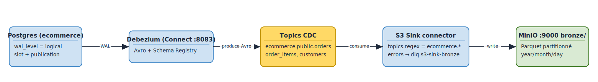

# Lab L4 — Patterns d'ingestion : Connect, Debezium CDC, S3 sink, DLQ
**Durée** : 2h
**Stack** : Kafka Connect (distributed), Debezium Postgres 2.5, Confluent S3 Sink 10.5, MinIO, Schema Registry, Avro

> **Cours associé** : M6.1 — Kafka Connect (1ʳᵉ passe, focus Connect), puis M7.3 — Lab PG → Debezium → Kafka et M7.4 — Lab CDC → Bronze (2ᵉ passe, focus CDC). Les extraits de configs Debezium des chapitres 6 et 7 viennent de ce lab.

## Objectifs

- Comprendre Kafka Connect en mode **distributed** (workers, REST API, internal topics).
- Configurer **Debezium Postgres** pour capturer en streaming les `INSERT/UPDATE/DELETE` des tables `customers`, `orders`, `order_items`.
- Configurer un **S3 Sink** (vers MinIO) qui matérialise un **bronze layer** au format **Parquet**, partitionné par topic et par date.
- Mettre en place une **Dead Letter Queue (DLQ)** pour isoler les messages non traitables sans bloquer la pipeline.
- Faire le lien CDC -> Kafka -> bronze layer dans le pattern **médaillon** (bronze / silver / gold).

## Prérequis

- L1 et L2 terminés : cluster up (`make health` au vert), Schema Registry joignable.
- L'infra Docker complète tourne (`docker compose ps` : `connect`, `postgres`, `minio`, `mc`, `kafka1-3`, `schema-registry` sont tous `running` et `healthy`).
- Postgres a déjà été initialisé via `docker/postgres/init.sql` avec :
  - `wal_level=logical` (positionné par la commande `postgres` dans `docker-compose.yml`)
  - tables `customers`, `orders`, `order_items` avec `REPLICA IDENTITY FULL`
  - publication `debezium_pub` couvrant les 3 tables
- Buckets MinIO créés par le service `mc` : `bronze`, `silver`, `gold`, `connect-backup`.
- Outils hôte : `curl`, `jq`, `psql` (optionnel — sinon on passe par `docker exec`).

Variables d'environnement utilisées :

| Variable                  | Défaut                                                |
|---------------------------|-------------------------------------------------------|
| `CONNECT_URL`             | `http://localhost:8083`                               |
| `BOOTSTRAP_SERVERS`       | `localhost:9092,localhost:9093,localhost:9094`        |
| `SCHEMA_REGISTRY_URL`     | `http://localhost:8081`                               |
| `MINIO_ENDPOINT`          | `http://localhost:9000`                               |
| `MINIO_ACCESS_KEY`        | `minioadmin`                                          |
| `MINIO_SECRET_KEY`        | `minioadmin`                                          |
| `PGHOST`/`PGPORT`         | `localhost` / `5432`                                  |
| `PGUSER`/`PGPASSWORD`     | `postgres` / `postgres`                               |
| `PGDATABASE`              | `ecommerce`                                           |

## Architecture

Schéma de référence du lab : Postgres alimente Debezium qui publie sur Kafka un topic CDC par table. Le S3 Sink consomme **tous** ces topics (pattern `ecommerce\..*`) et matérialise un bronze layer Parquet partitionné. En parallèle, des consumers applicatifs (Spark, services métier) peuvent consommer les mêmes topics pour construire silver/gold.

<!-- mermaid-source
%%{init: {'theme':'base', 'themeVariables': {'primaryColor':'#1F2937','primaryTextColor':'#F9FAFB','primaryBorderColor':'#374151','lineColor':'#6366F1','fontFamily':'Inter, system-ui, sans-serif','fontSize':'14px'}}}%%
flowchart LR
    PG[(Postgres<br/>ecommerce<br/>wal_level=logical)] --&gt;|"slot pgoutput<br/>publication debezium_pub"| DBZ

        DBZ[Debezium Postgres<br/>source connector]
        S3[S3 Sink<br/>topics.regex=ecommerce\..*]
    CONNECT["Kafka Connect (distributed) :8083"]


    DBZ --&gt;|Avro + SR| T1[("ecommerce.public.customers")]
    DBZ --&gt;|Avro + SR| T2[("ecommerce.public.orders")]
    DBZ --&gt;|Avro + SR| T3[("ecommerce.public.order_items")]

    T1 --&gt; S3
    T2 --&gt; S3
    T3 --&gt; S3

    T1 -.->|consumers métier| APP[Apps / Spark / KStreams<br/>silver / gold]
    T2 -.-> APP
    T3 -.-> APP

    S3 --&gt;|Parquet partitionné| BR[("MinIO :9000<br/>bucket bronze/<br/>topics/.../year=/month=/day=/hour=")]

    SR[(Schema Registry :8081)] <-.-> DBZ
    SR <-.-> S3

    DLQ[("dlq.s3-sink-bronze")]
    S3 -. "errors.tolerance=all" .-> DLQ

    class PG source
    class DBZ,S3 compute
    class T1,T2,T3,DLQ kafka
    class SR registry
    class BR bronze
    class APP sink

    classDef kafka fill:#0EAA47,stroke:#0E7C32,color:#fff,stroke-width:2px
    classDef source fill:#3B82F6,stroke:#1E40AF,color:#fff,stroke-width:2px
    classDef sink fill:#A855F7,stroke:#7E22CE,color:#fff,stroke-width:2px
    classDef bronze fill:#B45309,stroke:#78350F,color:#fff,stroke-width:2px
    classDef registry fill:#F59E0B,stroke:#B45309,color:#fff,stroke-width:2px
    classDef compute fill:#EC4899,stroke:#BE185D,color:#fff,stroke-width:2px
    classDef storage fill:#06B6D4,stroke:#0E7490,color:#fff,stroke-width:2px
-->

[Source Excalidraw](../../figures/L4/01.excalidraw)

### Pourquoi ces choix techniques ?

- **Avro + Schema Registry** plutôt que JSON : payload **3 à 10x plus compact** (encodage binaire, pas de répétition des noms de champs), **schéma versionné** côté SR (compatibilité backward vérifiée à la production), erreurs de désérialisation détectées tôt. JSON conviendrait pour un debug rapide, jamais pour une pipeline bronze de production.
- **SMT `unwrap` (ExtractNewRecordState)** côté Debezium : par défaut un message Debezium contient une enveloppe `{ before, after, op, source, ts_ms }`. Le bronze layer veut typiquement la **ligne actuelle** (équivalente à `SELECT * FROM table`) — l'unwrap aplatit le payload sur le contenu de `after`, conservant `__deleted` et les métadonnées utiles via `add.fields`.
- **Partitionnement `topic / year / month / day / hour`** sur S3 : permet à Spark/Trino/DuckDB de pruner les fichiers par table et par fenêtre temporelle (`WHERE year=2026 AND month=04`), évite les listings S3 coûteux et facilite la rétention par jour.
- **Format Parquet** plutôt qu'Avro/JSON sur S3 : colonnaire, compressé (snappy par défaut), prêt pour les requêtes analytiques. Avro reste utile sur Kafka (row-based, append-friendly), pas sur le stockage objet pour de l'OLAP.
- **DLQ** : un seul mauvais message ne doit jamais arrêter un connector qui consomme des topics partagés. La DLQ isole les "poison pills" (schéma incompatible, valeur null sur une colonne non-nullable, payload corrompu) sans perdre les autres messages.

## Étape 1 — Vérifier Connect et les plugins disponibles

```bash
# Connect répond ?
curl -s http://localhost:8083/ | jq .
# -> { "version": "7.6.0-...", "commit": "...", "kafka_cluster_id": "MkU3OEVBNTcwNTJENDM2Qg" }

# Plugins installés ?
curl -s http://localhost:8083/connector-plugins | jq '.[].class'
```

Tu dois voir notamment :
- `io.debezium.connector.postgresql.PostgresConnector`
- `io.confluent.connect.s3.S3SinkConnector`
- `io.confluent.connect.jdbc.JdbcSourceConnector` / `JdbcSinkConnector`

```bash
# Aucun connector déployé pour l'instant
curl -s http://localhost:8083/connectors | jq .
# -> []
```

Les **internal topics** Connect (`connect-configs`, `connect-offsets`, `connect-status`) doivent exister :

```bash
docker exec -e KAFKA_OPTS= kafka1 kafka-topics --bootstrap-server kafka1:29092 --list | grep ^connect-
```

## Étape 2 — Configurer le source connector Debezium Postgres

Inspecter `connectors/debezium-postgres-source.json` (les commentaires sont des annotations pédagogiques, pas du JSON valide — relire les choix expliqués dans la section *Pourquoi ces choix techniques ?*) :

```bash
cat connectors/debezium-postgres-source.json | jq .
```

Points clés de la config :
- `plugin.name = pgoutput` — utilise le plugin natif Postgres (pas besoin d'extension `wal2json`).
- `slot.name = debezium_slot` — slot de réplication créé automatiquement par Debezium au premier démarrage.
- `publication.name = debezium_pub` — publication créée par `init.sql`.
- `topic.prefix = ecommerce` — préfixe de tous les topics CDC -> `ecommerce.public.customers`, etc.
- `table.include.list = public.customers,public.orders,public.order_items`.
- Convertisseurs **Avro** + Schema Registry pour clé et valeur.
- SMT `unwrap` (`ExtractNewRecordState`) avec `delete.handling.mode = rewrite` pour matérialiser les DELETE comme des lignes avec `__deleted = true` (utile pour le bronze).

Déployer :

```bash
./scripts/register-debezium.sh
```

Vérifier l'état :

```bash
curl -s http://localhost:8083/connectors/debezium-postgres-source/status | jq .
```

Le `connector.state` et chaque task doivent être `RUNNING`. Si tu vois `FAILED`, lire **Dépannage** ci-dessous (slot déjà existant, publication manquante, etc.).

### Check visuel — Connect et Grafana

Ouvrir :

- Kafka UI : <http://localhost:18080>, onglet **Kafka Connect**
- Grafana : <http://localhost:13000>, dashboards **Kafka Learning Dashboard** et **Kafka Connect**

Screenshots recommandés :

| Screenshot | Outil | Validation attendue |
|---|---|---|
| `08-connect-debezium-running.png` | Kafka UI ou Connect REST | `debezium-postgres-source` en `RUNNING` |
| `10-connect-records-rate.png` | Grafana | le panel `Kafka Connect records / sec` bouge après les premières mutations |

Guide détaillé : Observabilité des labs.

## Étape 3 — Pre-creer les topics CDC, puis observer

> **Important** : notre cluster a `auto.create.topics.enable=false`. Cela signifie que **Debezium ne peut pas creer les topics automatiquement** — il boucle sur `UNKNOWN_TOPIC_OR_PARTITION` jusqu'a ce qu'on les cree manuellement (ou qu'on ajoute `topic.creation.enable=true` au connector, voir la fin de cette etape).

Creer les 3 topics CDC en avance avec les bons reglages (RF=3, ISR=2) :

```bash
for table in customers orders order_items; do
  docker exec -e KAFKA_OPTS= kafka1 kafka-topics \
    --bootstrap-server kafka1:29092 --create \
    --topic ecommerce.public.$table \
    --partitions 6 --replication-factor 3 \
    --config min.insync.replicas=2 \
    --if-not-exists
done
```

Au premier demarrage, Debezium prend un **snapshot** des tables existantes puis bascule en streaming. Lister les topics CDC :

```bash
docker exec -e KAFKA_OPTS= kafka1 kafka-topics --bootstrap-server kafka1:29092 --list | grep ^ecommerce
```

Tu dois voir les 3 topics :

```
ecommerce.public.customers
ecommerce.public.orders
ecommerce.public.order_items
```

> **Alternative** : on peut deleguer la creation a Connect en ajoutant a la config du connecteur `"topic.creation.enable": "true"` + une politique par defaut (ex: `topic.creation.default.replication.factor = 3`, `topic.creation.default.partitions = 6`). C'est l'approche moderne (Connect 2.6+) — on l'evite ici pour montrer explicitement les topics que la pipeline cree, mais en production c'est recommande.

Decrire un topic pour confirmer la config (RF=3, partitions=6, ISR>=2) :

```bash
docker exec -e KAFKA_OPTS= kafka1 kafka-topics --bootstrap-server kafka1:29092 \
  --describe --topic ecommerce.public.customers
```

Vérifier les schémas enregistrés côté SR (un *value* schema par topic, plus un *key* schema basé sur la PK) :

```bash
curl -s http://localhost:8081/subjects | jq .
```

## Étape 4 — Inspecter un changement (UPDATE -> message CDC)

Faire un UPDATE générant un événement CDC :

```bash
./scripts/make-update.sh
```

Le script lance un `psql` qui change l'email du customer 1 et fait passer un order de `pending -> paid`.

Lire les messages produits (Avro -> JSON via le `kafka-avro-console-consumer`) :

```bash
./scripts/inspect-topic.sh ecommerce.public.customers
```

Avec la SMT `unwrap` activée, le payload est **aplati** : tu vois directement les champs de la ligne (`customer_id`, `email`, `first_name`, ...) au lieu de l'enveloppe Debezium `{ before, after, op, source }`.

Pour voir le format **non aplati** (à des fins pédagogiques uniquement), il faudrait retirer la SMT et redéployer le connector — un payload typique ressemblerait alors à :

```json
{
  "before": { "customer_id": 1, "email": "alice@example.com", ... },
  "after":  { "customer_id": 1, "email": "alice.new@example.com", ... },
  "source": { "version": "2.5.4.Final", "connector": "postgresql", "name": "ecommerce", "ts_ms": 1714300000000, "lsn": ..., "txId": ..., ... },
  "op": "u",
  "ts_ms": 1714300000123
}
```

Avec `unwrap + add.fields=op,table,source.ts_ms,source.lsn`, le bronze récupère la ligne actuelle plus juste les métadonnées utiles (operation, table source, timestamp WAL, LSN pour ordering).

## Étape 5 — Configurer le sink S3 (MinIO) pour matérialiser bronze

Inspecter `connectors/s3-sink-bronze.json`. Points clés :
- `topics.regex = ecommerce\\..*` — abonnement à toutes les tables CDC d'un coup.
- `s3.bucket.name = bronze`.
- `store.url = http://minio:9000` (depuis le réseau Docker `kafka-net`).
- `format.class = io.confluent.connect.s3.format.parquet.ParquetFormat`.
- `partitioner.class = io.confluent.connect.storage.partitioner.TimeBasedPartitioner`.
- `path.format = 'year'=YYYY/'month'=MM/'day'=dd/'hour'=HH` — le nom du topic vient de `topics.dir` (défaut `topics`), pas de `path.format`.
- `flush.size = 1`, `rotate.interval.ms = 60000` — en lab, chaque événement CDC est écrit immédiatement (en prod on augmente `flush.size` pour grouper les écritures).
- Auth MinIO : passée **directement dans la config du connector** via `aws.access.key.id` et `aws.secret.access.key` (cf. note ci-dessous).

### Note importante : credentials MinIO

Le S3 Sink Confluent supporte trois mécanismes d'auth, par ordre de priorité :
1. **Variables d'environnement** `AWS_ACCESS_KEY_ID` / `AWS_SECRET_ACCESS_KEY` injectées au container Connect (à ajouter dans `docker-compose.yml` puis `docker compose up -d connect`).
2. **Champs `aws.access.key.id` / `aws.secret.access.key` dans la config** du connector (ce que nous faisons ici — les credentials sont stockés dans le topic `connect-configs`, donc **jamais commiter une config réelle** sur Git).
3. **`credentials.provider.class`** — délégation à un provider IAM (utile en production sur AWS, pas pour ce lab).

Pour un environnement de prod, préférer (1) avec un secret manager.

Déployer :

```bash
./scripts/register-s3-sink.sh
```

Suivre le statut :

```bash
curl -s http://localhost:8083/connectors/s3-sink-bronze/status | jq .
```

## Étape 6 — Vérifier les fichiers Parquet sur MinIO

Ouvrir la console MinIO sur [http://localhost:9001](http://localhost:9001) (login `minioadmin / minioadmin`), naviguer dans le bucket `bronze` :

```
bronze/
  topics/
    ecommerce.public.customers/
      year=2026/month=04/day=28/hour=14/
        ecommerce.public.customers+0+0000000000.parquet
        ecommerce.public.customers+0+0000000001.parquet
    ecommerce.public.orders/
      ...
    ecommerce.public.order_items/
      ...
```

Le nom de fichier suit le pattern `{topic}+{partition}+{startOffset}.parquet`.

Lire un fichier en Python via `boto3` + `pyarrow` :

```bash
python3 scripts/read-minio.py bronze ecommerce.public.customers
```

Le script liste les Parquet sous le préfixe et affiche les premières lignes du plus récent.

### Inspection ad-hoc avec DuckDB (sans téléchargement, sans Python)

Le service `duckdb` du `docker-compose.yml` requête directement les Parquet du bucket via S3. C'est le moyen le plus rapide de valider la sortie du S3 Sink — pas de `boto3`, pas de `pyarrow`, pas de download local.

```bash
docker exec -it duckdb duckdb -init /init.sql
```

Deux interfaces possibles :

- **CLI** (ci-dessus) : DB en mémoire, `init.sql` auto-chargé (extensions + secret S3).
- **Notebook web** (DuckDB Local UI) : <http://localhost:4213> — éditeur SQL navigateur, exploration de schéma, résultats tabulés. Idéal en formation pour projeter. _Note : l'app de l'UI est servie par `ui.duckdb.org` (sortie HTTPS requise) ; vos **données** ne quittent jamais MinIO._

Le S3 Sink écrit l'arborescence `bronze/topics/<topic>/year=.../month=.../day=.../hour=.../`. Le nom de topic est un dossier simple, et `year/month/day/hour` sont des partitions Hive — DuckDB peut les exposer comme colonnes :

```sql
-- 1. Lire tous les Parquet d'un topic, partitions year/month/day/hour exposées en colonnes
SELECT *
FROM read_parquet('s3://bronze/topics/ecommerce.public.customers/**/*.parquet',
                   hive_partitioning = true)
LIMIT 10;

-- 2. Compter les lignes par jour (year/month/day viennent du chemin Hive)
SELECT year, month, day, count(*)
FROM read_parquet('s3://bronze/topics/ecommerce.public.orders/**/*.parquet',
                   hive_partitioning = true)
GROUP BY year, month, day
ORDER BY year, month, day;

-- 3. Voir l'effet de l'unwrap : __deleted + métadonnées __op / __source_ts_ms
SELECT customer_id, __deleted, __op, __source_ts_ms
FROM read_parquet('s3://bronze/topics/ecommerce.public.customers/**/*.parquet')
ORDER BY __source_ts_ms DESC
LIMIT 20;

-- 4. Lister les fichiers physiques produits par le sink
SELECT * FROM glob('s3://bronze/topics/ecommerce.public.orders/**/*.parquet');
```

> Contraste pédagogique avec L5/L6 : ici le bronze est du **Parquet brut partitionné** (pas de table Delta, pas de `_delta_log/`). DuckDB lit donc directement les fichiers — il n'y a pas de notion de version ni de transaction ACID à ce niveau. C'est exactement la différence bronze "fichiers" (L4, S3 Sink) vs bronze "table Delta" (L5, Spark) discutée dans T4 §3.2.

Si rien n'apparaît dans `bronze`, vérifier d'abord que le connector est `RUNNING`. Avec `flush.size=1`, chaque événement CDC produit un fichier Parquet immédiatement — il suffit d'émettre quelques changements :

```bash
for i in $(seq 1 100); do
  docker exec -e PGPASSWORD=postgres postgres psql -U postgres -d ecommerce \
    -c "UPDATE customers SET updated_at = NOW() WHERE customer_id = $((i % 10 + 1));"
done
# Avec flush.size=1, les fichiers Parquet apparaissent au fil des UPDATE (pas d'attente de batch)
```

## Étape 7 — DLQ : configurer error-tolerance et observer

Notre `s3-sink-bronze` est déjà configuré avec :

```json
"errors.tolerance": "all",
"errors.deadletterqueue.topic.name": "dlq.s3-sink-bronze",
"errors.deadletterqueue.context.headers.enable": "true",
"errors.log.enable": "true",
"errors.log.include.messages": "true"
```

Pour démontrer la DLQ, le fichier `connectors/s3-sink-with-dlq.json` configure un sink **séparé** ciblant uniquement `ecommerce.public.customers`, mais avec un **converter intentionnellement incompatible** (StringConverter au lieu d'AvroConverter sur la value) — ce qui force chaque message Avro à finir en DLQ.

Créer le topic DLQ d'abord (sinon Connect crée un topic mono-partition par défaut, peu pratique) :

```bash
docker exec -e KAFKA_OPTS= kafka1 kafka-topics --bootstrap-server kafka1:29092 \
  --create --topic dlq.s3-sink-bronze \
  --partitions 3 --replication-factor 3 \
  --config retention.ms=604800000   # 7 jours
```

Déployer le sink DLQ-démo :

```bash
curl -X POST -H "Content-Type: application/json" \
  --data @connectors/s3-sink-with-dlq.json \
  http://localhost:8083/connectors | jq .
```

Lire la DLQ :

```bash
docker exec -e KAFKA_OPTS= kafka1 kafka-console-consumer \
  --bootstrap-server kafka1:29092 \
  --topic dlq.s3-sink-bronze \
  --from-beginning \
  --property print.headers=true \
  --max-messages 5
```

Les **headers** contiennent `__connect.errors.topic`, `__connect.errors.partition`, `__connect.errors.exception.class.name`, `__connect.errors.exception.message` — c'est la trace complète pour rejouer ou diagnostiquer.

Nettoyer le sink démo une fois la lecture faite :

```bash
curl -X DELETE http://localhost:8083/connectors/s3-sink-with-dlq | jq .
```

## Étape 8 — Reprocessing : replay du topic CDC vers un nouveau bucket

Pattern courant : on a découvert un bug dans la pipeline silver et on veut **rejouer** tout le bronze depuis l'origine vers un nouveau bucket de retraitement, **sans toucher au sink prod**.

Approche : déployer un **nouveau sink** avec un `name` différent (donc un consumer group dédié, position d'offsets indépendante) qui pointe sur un autre bucket et qui démarre depuis `earliest`.

```bash
# Copier la config bronze, changer name, bucket, et forcer earliest
jq '.name = "s3-sink-replay" |
    .config["s3.bucket.name"] = "connect-backup" |
    .config["consumer.override.auto.offset.reset"] = "earliest" |
    .config["topics.dir"] = "replay-2026-04-28"' \
   connectors/s3-sink-bronze.json > /tmp/s3-sink-replay.json

curl -X POST -H "Content-Type: application/json" \
  --data @/tmp/s3-sink-replay.json \
  http://localhost:8083/connectors | jq .

# Suivre la progression
curl -s http://localhost:8083/connectors/s3-sink-replay/status | jq .

# Quand le replay est terminé, supprimer le connector (ne supprime pas les fichiers MinIO)
curl -X DELETE http://localhost:8083/connectors/s3-sink-replay
```

Note clé : `consumer.override.auto.offset.reset=earliest` n'a d'effet **qu'à la première création** du consumer group. Si tu redéploies un connector portant le même nom après avoir consommé, il reprendra à son dernier offset — d'où le changement de `name`.

## Validation

- [ ] Connector `debezium-postgres-source` en état `RUNNING`, 1 task `RUNNING`.
- [ ] Topics `ecommerce.public.customers`, `ecommerce.public.orders`, `ecommerce.public.order_items` créés et alimentés (le snapshot initial a publié les lignes seed).
- [ ] Subjects Avro visibles dans Schema Registry : `ecommerce.public.customers-key`, `ecommerce.public.customers-value`, etc.
- [ ] Connector `s3-sink-bronze` en état `RUNNING`.
- [ ] Bucket `bronze` contient des fichiers `.parquet` sous `topics/<topic>/year=.../...`.
- [ ] Un `UPDATE` Postgres apparaît bien dans le topic CDC correspondant en moins de 5s (script `make-update.sh` + `inspect-topic.sh`).
- [ ] Démo DLQ : la DLQ `dlq.s3-sink-bronze` reçoit des messages quand on déploie le sink mal configuré, et **le sink bronze prod continue de RUNNING** (validation que `errors.tolerance=all` n'a pas d'impact croisé).
- [ ] `read-minio.py` lit un Parquet et affiche les colonnes `customer_id`, `email`, `__deleted`, etc.

## Pour aller plus loin (challenges)

1. **SMT chain pour anonymiser un champ** : ajouter une transformation `MaskField` après `unwrap` pour masquer `email` dans le bronze, et une seconde route avec un autre topic destination contenant la version non masquée pour usage interne. Voir `solutions/L4-kafka-connect-cdc/connectors/s3-sink-with-smt.json`.
2. **Iceberg sink** : remplacer le S3 Sink Parquet par un sink Iceberg (Tabular `iceberg-kafka-connect`) pour bénéficier des **table formats** (snapshots, time travel, schema evolution gérée). Voir `solutions/L4-kafka-connect-cdc/connectors/iceberg-sink.json` (stub commenté si le plugin n'est pas installé).
3. **Schema evolution** : ajouter une colonne `loyalty_tier` à `customers`, vérifier que Debezium publie un nouveau schéma compatible **backward** dans SR, puis observer comment le S3 Sink gère le changement (nouveau Parquet avec colonne supplémentaire, anciens fichiers inchangés — c'est à Spark/Trino de gérer la lecture multi-version).
4. **Routing par SMT** : utiliser `RegexRouter` pour réécrire `ecommerce.public.customers -> bronze.customers` avant le sink — utile pour découpler le nommage Postgres du nommage Kafka.
5. **JDBC Sink** : mettre en place un sink JDBC qui matérialise le topic `ecommerce.public.orders` dans une autre base Postgres (lecture analytique séparée de l'OLTP).

## Dépannage

| Symptôme | Diagnostic | Action |
|---|---|---|
| Debezium reste `FAILED` au boot avec `replication slot "debezium_slot" already exists` | Un précédent run a laissé un slot orphelin | `docker exec -e PGPASSWORD=postgres postgres psql -U postgres -d ecommerce -c "SELECT pg_drop_replication_slot('debezium_slot');"` puis redéployer |
| Debezium `FAILED` avec `publication "debezium_pub" does not exist` | `init.sql` n'a pas tourné (volume préexistant) | `docker compose down -v` puis `docker compose up -d` (perte des données Postgres) ou recréer manuellement la publication |
| Debezium `FAILED` avec `must be superuser to create REPLICATION` | User Postgres sans le rôle `REPLICATION` | Notre `init.sql` fonctionne avec le superuser `postgres` ; sinon `ALTER ROLE <user> WITH REPLICATION;` |
| Aucun message ne sort sur les topics CDC | Tables vides ou `table.include.list` mal écrit | Vérifier `SELECT * FROM customers;` côté Postgres, vérifier la regex dans la config |
| S3 Sink `FAILED` avec `403 Forbidden` ou `Access Denied` | Mauvaises credentials ou bucket inexistant | Vérifier `aws.access.key.id`, ouvrir [http://localhost:9001](http://localhost:9001), confirmer que le bucket `bronze` existe |
| S3 Sink `RUNNING` mais aucun fichier dans MinIO | Connector sans changement à traiter | Émettre un UPDATE (avec `flush.size=1`, le fichier apparaît aussitôt) ; vérifier `tasks-status` pour les WARN |
| S3 Sink écrit dans le bucket mais pas dans le sous-dossier attendu | Mauvais `path.format` ou `topics.dir` | Lire les logs `docker logs connect | grep S3SinkTask` |
| DLQ `dlq.s3-sink-bronze` se remplit en boucle | Schéma incompatible côté sink ou converter mal configuré | Inspecter les headers d'erreur d'un message DLQ (`__connect.errors.exception.message`), corriger la config et `restart-connector.sh` |
| `inspect-topic.sh` affiche `magic byte not found` | Le topic est en JSON, pas Avro | Le converter Debezium est mal configuré (probablement la SMT a été retirée ou un value.converter override traîne) |
| Lag du connector qui croît | Une seule task et trop de partitions | Augmenter `tasks.max` dans la config (Debezium reste 1 task max — c'est un fan-out, augmenter côté S3 Sink pour scaler) |
| `connect` redémarre toutes les 30s | `CONNECT_BOOTSTRAP_SERVERS` mal pointé ou broker indisponible | `docker logs connect` ; vérifier `make health` |

À l'issue de ce lab, le **bronze layer** est alimenté en streaming par Debezium et le pattern d'ingestion est en place pour le **Lab L5 — Streaming Spark vers silver/gold**.
