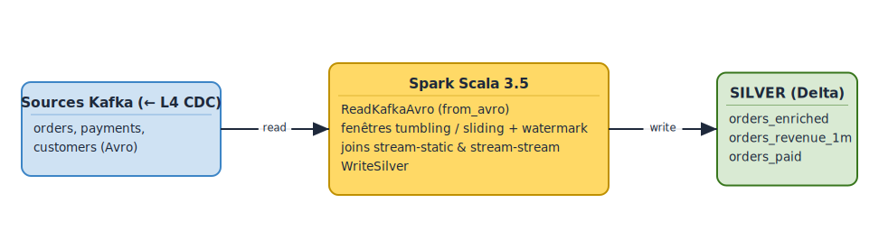
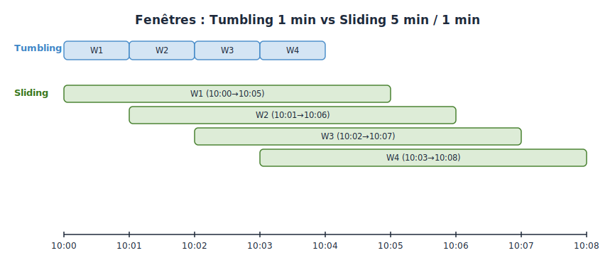
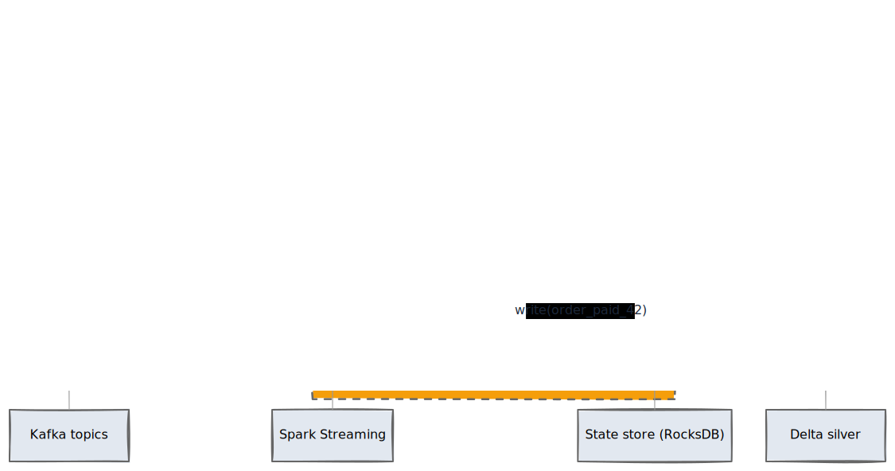

# Lab L6 — Scala Spark Structured Streaming : windowing, watermarks, joins
**Durée** : 2h
**Stack** : Scala 2.12.18, Spark 3.5, Kafka, Delta Lake 3.1, MinIO (S3 compatible)

> **Cours associé** : M9.2 — Lab Kafka → Bronze et M9.3 — File streaming — variante Scala du Spark Structured Streaming vers bronze.
> **Paire bilingue** : [L5-pyspark-streaming](../../labs/L5-pyspark-streaming/lab.md) — même contenu en PySpark. Faire **L5 ou L6** selon le langage cible (L6 = parcours JVM, plus typé).

## Objectifs

À l'issue de ce lab, l'apprenant sera capable de :

- Construire un pipeline **Spark Structured Streaming en Scala typé** (case class + Encoders) à partir d'un topic Kafka Avro.
- Distinguer et coder les trois familles de fenêtres : **tumbling**, **sliding** et **session windows**.
- Maîtriser la sémantique du **watermark** : différence entre *late data drop* et `withEventTimeOrder` / `allowedLateness`, impact sur la mémoire d'état.
- Réaliser un **stream-static join** (enrichir un flux avec une dimension Delta) et un **stream-stream join** avec watermarks et `joinTime` interval.
- Écrire des résultats vers la couche **silver** d'une architecture médaillon (S3/MinIO en Delta Lake).
- **Comparer l'ergonomie Scala vs PySpark** (cf. L5) et choisir l'API selon le contexte.

## Prérequis

- L1 terminé : cluster Docker `up` (3 brokers, Schema Registry, MinIO, Spark cluster).
- L4 terminé : connector Debezium qui pousse `ecommerce.public.customers` et `ecommerce.public.orders` dans Kafka (en Avro avec Schema Registry).
- L5 terminé : pipeline PySpark qui matérialise les topics CDC dans le **bronze layer** (`s3a://bronze/orders`, `s3a://bronze/customers`) en Delta. Ce lab consomme ces données ainsi que les topics CDC bruts.
- JDK 17, sbt 1.10 (`sbt --version`), `aws` CLI optionnel pour vérifier MinIO.

Vérifications rapides :

```bash
docker compose ps                                  # tous services up
curl -s http://localhost:8081/subjects | jq        # Schema Registry voit les sujets CDC
curl -s http://localhost:9000/minio/health/live    # MinIO vivant
# Buckets bronze / silver / gold doivent exister (créés en L1)
```

Variables d'environnement (résolues par `application.conf`, surchageables) :

| Variable                | Défaut                                                |
|-------------------------|-------------------------------------------------------|
| `BOOTSTRAP_SERVERS`     | `kafka1:29092,kafka2:29092,kafka3:29092`              |
| `SCHEMA_REGISTRY_URL`   | `http://schema-registry:8081`                         |
| `S3_ENDPOINT`           | `http://minio:9000`                                   |
| `S3_ACCESS_KEY`         | `minioadmin`                                          |
| `S3_SECRET_KEY`         | `minioadmin`                                          |
| `BRONZE_PATH`           | `s3a://bronze/`                                       |
| `SILVER_PATH`           | `s3a://silver/`                                       |
| `CHECKPOINT_PATH`       | `s3a://silver/_checkpoints/`                          |
| `TOPIC_ORDERS`          | `ecommerce.public.orders`                             |
| `TOPIC_PAYMENTS`        | `ecommerce.public.payments`                           |
| `TOPIC_CUSTOMERS`       | `ecommerce.public.customers`                          |

> Note : le topic `payments` n'existe pas dans la base e-commerce du L4. Pour ce lab, on génère un topic synthétique via un petit producer (étape 8). Cela permet d'exercer le **stream-stream join** sans alourdir l'infra.

## Architecture

<!-- mermaid-source
%%{init: {'theme':'base', 'themeVariables': {'primaryColor':'#1F2937','primaryTextColor':'#F9FAFB','primaryBorderColor':'#374151','lineColor':'#6366F1','fontFamily':'Inter, system-ui, sans-serif','fontSize':'14px'}}}%%
flowchart LR
    subgraph SRC["Sources Kafka (alimentées par L4 CDC)"]
        TO[("ecommerce.public.orders<br/>Avro CDC")]
        TP[("ecommerce.public.payments<br/>Avro synthétique")]
        TC[("ecommerce.public.customers<br/>Avro CDC")]
    end
    subgraph BRONZE["BRONZE — alimenté par L5"]
        BC[(customers Delta<br/>s3a://bronze/customers)]
    end
    subgraph APP["Application Spark Scala 2.12 / Spark 3.5"]
        RK[ReadKafkaAvro<br/>from_avro]
        TW[TumblingWindow<br/>1 min]
        SW[SlidingWindow<br/>5/1 min]
        WM[WatermarkDemo<br/>late data]
        SSJ[StreamStaticJoin<br/>orders + customers]
        SS[StreamStreamJoin<br/>orders + payments]
        WS[WriteSilver<br/>Delta]
    end
    subgraph SILVER["SILVER — produit par ce lab"]
        SO[(silver/orders_enriched)]
        SR[(silver/orders_revenue_1m)]
        SP[(silver/orders_paid)]
    end

    TO --&gt; RK
    TP --&gt; RK
    TC --&gt; RK
    RK --&gt; TW --&gt; WS
    RK --&gt; SW --&gt; WS
    RK --&gt; WM
    BC --&gt; SSJ
    RK --&gt; SSJ --&gt; WS
    RK --&gt; SS --&gt; WS
    WS --&gt; SO
    WS --&gt; SR
    WS --&gt; SP

    class TO,TP,TC kafka
    class BC bronze
    class SO,SR,SP silver
    class RK,TW,SW,WM,SSJ,SS,WS compute
    classDef kafka fill:#0EAA47,stroke:#0E7C32,color:#fff,stroke-width:2px
    classDef bronze fill:#CD7F32,stroke:#8B5A2B,color:#fff,stroke-width:2px
    classDef silver fill:#C0C0C0,stroke:#8C8C8C,color:#1F2937,stroke-width:2px
    classDef compute fill:#EC4899,stroke:#BE185D,color:#fff,stroke-width:2px
-->

[Source Excalidraw](../../figures/L6/01.excalidraw)

Tumbling vs sliding windows (rappel visuel) :

<!-- mermaid-source
%%{init: {'theme':'base', 'themeVariables': {'primaryColor':'#1F2937','primaryTextColor':'#F9FAFB','primaryBorderColor':'#374151','lineColor':'#6366F1','fontFamily':'Inter, system-ui, sans-serif','fontSize':'14px'}}}%%
gantt
    title Tumbling 1 min vs Sliding 5 min / 1 min
    dateFormat HH:mm
    axisFormat %H:%M
    section Tumbling
    W1 (10:00-10:01)   :t1, 10:00, 1m
    W2 (10:01-10:02)   :t2, 10:01, 1m
    W3 (10:02-10:03)   :t3, 10:02, 1m
    W4 (10:03-10:04)   :t4, 10:03, 1m
    section Sliding
    W1 (10:00-10:05)   :s1, 10:00, 5m
    W2 (10:01-10:06)   :s2, 10:01, 5m
    W3 (10:02-10:07)   :s3, 10:02, 5m
    W4 (10:03-10:08)   :s4, 10:03, 5m
-->

[Source Excalidraw](../../figures/L6/02.excalidraw)

Stream-stream join (orders ↔ payments) — diagramme de séquence :

<!-- mermaid-source
%%{init: {'theme':'base', 'themeVariables': {'primaryColor':'#1F2937','primaryTextColor':'#F9FAFB','primaryBorderColor':'#374151','lineColor':'#6366F1','fontFamily':'Inter, system-ui, sans-serif','fontSize':'14px'}}}%%
sequenceDiagram
    autonumber
    participant K as Kafka topics
    participant S as Spark Streaming
    participant ST as State store (RocksDB)
    participant D as Delta silver
    K->>S: order(id=42, ts=10:00:00)
    S->>ST: bufferise order 42 jusqu'à watermark+15min
    K->>S: payment(order_id=42, ts=10:00:08)
    S->>ST: cherche order 42 dans le buffer
    ST--&gt;>S: match (delta=8s, dans interval 0-15min)
    S->>D: write(order_paid_42)
    Note over S,ST: si payment > watermark+15min : drop (late)
    Note over S,ST: si pas de match avant expiration : row supprimée du state
-->

[Source Excalidraw](../../figures/L6/03.excalidraw)

## Étape 1 — Setup sbt project + dépendances

Se placer dans le dossier du lab :

```bash
cd labs/L6-scala-spark-streaming
sbt update
sbt compile
```

Inspecter `build.sbt` :

- `scalaVersion := "2.12.18"`. Spark 3.5 publie en 2.12 et 2.13. On reste **2.12** pour rester compatible avec le plus grand nombre de connecteurs et plugins (`spark-avro`, `delta-spark`, `hadoop-aws`).
- Dépendances clés :
  - `org.apache.spark` % `spark-sql_2.12` % `3.5.0` % `provided` (fourni par le cluster).
  - `org.apache.spark` % `spark-sql-kafka-0-10_2.12` % `3.5.0` (connecteur source Kafka).
  - `org.apache.spark` % `spark-avro_2.12` % `3.5.0` (fonctions `from_avro`/`to_avro`).
  - `io.delta` % `delta-spark_2.12` % `3.1.0` (sink Delta + DeltaTable API).
  - `org.apache.hadoop` % `hadoop-aws` % `3.3.4` (S3A → MinIO).
  - `com.typesafe` % `config` % `1.4.3` (lecture `application.conf`).
- `assembly / assemblyMergeStrategy` : on exclut META-INF/services en doublon, sinon le shading explose.
- Resolvers : Maven Central + Confluent (`packages.confluent.io/maven`).

> **À noter** : on marque Spark `provided` pour réduire le fat-jar à ~30 Mo. Le cluster fournit `spark-core`, `spark-sql` et a déjà `delta-spark` + `hadoop-aws` dans son classpath (cf. `docker/spark/`). Si vous lancez en local sans cluster, retirer `provided` ou utiliser `sbt run`.

## Étape 2 — SparkSession en Scala

Fichier : `src/main/scala/lab/SparkApp.scala`. Le main initialise une `SparkSession` configurée pour Delta + S3A → MinIO.

```scala
val spark = SparkSession.builder()
  .appName("L6-scala-streaming")
  .config("spark.sql.extensions", "io.delta.sql.DeltaSparkSessionExtension")
  .config("spark.sql.catalog.spark_catalog", "org.apache.spark.sql.delta.catalog.DeltaCatalog")
  .config("spark.hadoop.fs.s3a.endpoint", config.s3Endpoint)
  .config("spark.hadoop.fs.s3a.access.key", config.s3AccessKey)
  .config("spark.hadoop.fs.s3a.secret.key", config.s3SecretKey)
  .config("spark.hadoop.fs.s3a.path.style.access", "true")
  .config("spark.hadoop.fs.s3a.connection.ssl.enabled", "false")
  .config("spark.sql.shuffle.partitions", "4")
  .getOrCreate()
spark.sparkContext.setLogLevel("WARN")
```

Trois points pédagogiques :

1. **DeltaSparkSessionExtension** est strictement requis pour que les fonctions Delta (MERGE, OPTIMIZE) soient disponibles depuis Scala.
2. `path.style.access=true` est obligatoire avec MinIO (S3 régulier accepte les *virtual-hosted-style*, MinIO non par défaut).
3. `shuffle.partitions=4` : valeur basse adaptée au cluster local 1 worker × 2 cores. En prod on règle à `200+`.

## Étape 3 — readStream Kafka + Avro typé (case class)

Fichier : `src/main/scala/lab/streaming/ReadKafkaAvro.scala`.

Le wire format Confluent est `[0x00][schemaId int32][payload Avro]`. Spark `from_avro` ne sait pas extraire `schemaId` à la volée — on récupère donc le schéma une fois au démarrage via l'API REST de Schema Registry, puis on **strippe les 5 octets de header** avant d'appeler `from_avro`.

```scala
import org.apache.spark.sql.avro.functions._
import org.apache.spark.sql.functions._

def readOrders(spark: SparkSession, cfg: Config): DataFrame = {
  val schema = SchemaRegistry.fetchValueSchema(cfg.schemaRegistryUrl, cfg.topicOrders)

  spark.readStream
    .format("kafka")
    .option("kafka.bootstrap.servers", cfg.bootstrapServers)
    .option("subscribe", cfg.topicOrders)
    .option("startingOffsets", "earliest")
    .option("failOnDataLoss", "false")
    .load()
    .select(
      col("key").cast("string").as("kafka_key"),
      // strip Confluent magic byte (1) + schema id (4) = 5 octets
      from_avro(expr("substring(value, 6, length(value)-5)"), schema).as("data"),
      col("timestamp").as("kafka_ts")
    )
    .select(col("kafka_key"), col("data.*"), col("kafka_ts"))
}
```

Définir une `case class Order` dans `model/Order.scala` (simplifiée par rapport au format Debezium *envelope* — on suppose que les SMTs `unwrap` ont déjà été appliqués côté connector) :

```scala
final case class Order(
  order_id: Long,
  customer_id: Long,
  status: String,
  total_amount: BigDecimal,
  currency: String,
  created_at: java.sql.Timestamp,
  updated_at: java.sql.Timestamp
)
```

Encoder typé :

```scala
import spark.implicits._
val ordersDS: Dataset[Order] = ordersDF.as[Order]
```

> **Scala vs PySpark** : ici Scala apporte une vraie sécurité de schéma — un renommage côté table (`total` → `total_amount`) déclenche une erreur de **compilation**, pas un `AttributeError` runtime à 3h du matin.

## Étape 4 — Tumbling window 1 min (count, sum) sur orders

Une *tumbling window* découpe le temps en intervalles disjoints de durée fixe. Chaque event tombe dans **exactement une** fenêtre.

```scala
val ordersWithWatermark = ordersDF.withWatermark("kafka_ts", "10 minutes")

val tumbling: DataFrame = ordersWithWatermark
  .groupBy(window(col("kafka_ts"), "1 minute"), col("status"))
  .agg(
    count("*").as("orders_count"),
    sum("total_amount").as("revenue")
  )
  .select(
    col("window.start").as("window_start"),
    col("window.end").as("window_end"),
    col("status"),
    col("orders_count"),
    col("revenue")
  )

tumbling.writeStream
  .format("delta")
  .outputMode("append")
  .option("checkpointLocation", s"${cfg.checkpointPath}orders_revenue_1m")
  .trigger(Trigger.ProcessingTime("30 seconds"))
  .start(s"${cfg.silverPath}orders_revenue_1m")
```

Pourquoi `outputMode("append")` ? Parce qu'avec un watermark une fenêtre devient *finalisée* dès que `watermark > window.end`, et Spark l'émet alors **une seule fois** — append-only safe pour Delta.

## Étape 5 — Sliding window 5 min / 1 min

Une *sliding window* a une durée et un *slide interval* différent. Chaque event tombe dans `durée / slide` fenêtres simultanément. On l'utilise pour des **moyennes mobiles**.

```scala
val sliding = ordersWithWatermark
  .groupBy(window(col("kafka_ts"), "5 minutes", "1 minute"), col("status"))
  .agg(
    avg("total_amount").as("avg_basket"),
    count("*").as("orders_count")
  )
```

> **Coût mémoire** : avec un slide de 1 min sur une fenêtre de 5 min, chaque event est dans 5 *open windows* en parallèle. Le state store grossit donc d'un facteur 5 par rapport au tumbling. Anticiper si le watermark est large.

## Étape 6 — Watermark : late data drop vs allowedLateness

Le watermark est une **borne mobile** sur l'event time. Spark considère qu'aucun event avec `kafka_ts < watermark` n'arrivera plus, donc :

- Les fenêtres dont `end <= watermark` sont **finalisées** (état libéré).
- Les events qui arrivent avec `kafka_ts < watermark` sont **droppés silencieusement**.

Démonstration dans `WatermarkDemo.scala` : on injecte volontairement un event en retard de 15 min via un petit producer Python ou via :

```bash
docker exec -it -e KAFKA_OPTS= kafka1 kafka-console-producer \
  --bootstrap-server kafka1:29092 --topic ecommerce.public.orders \
  # produire un message daté de 15 min plus tôt
```

Avec `withWatermark("kafka_ts", "10 minutes")` :

- Un event à -8 min est **accepté** : il met à jour la fenêtre déjà émise → le résultat ne change pas car `outputMode=append`. En `update`, il pousserait une mise à jour incrémentale.
- Un event à -15 min est **droppé**.

Métrique à surveiller : `numRowsDroppedByWatermark` dans `StreamingQueryProgress` (`spark.streams.active.head.lastProgress.stateOperators`).

> **Note importante** : Spark 3.5 ne propose pas de `allowedLateness` séparé du watermark (cette API n'existe que dans Beam / Flink). Pour tolérer plus de retard tout en finalisant tôt, la seule poignée est d'augmenter le watermark au prix d'une **mémoire d'état plus grande**. C'est le compromis fondamental : *accuracy* vs *resource*.

| Stratégie watermark    | Late data       | État                     | Latence d'émission     |
|------------------------|-----------------|--------------------------|------------------------|
| `0 second`             | Tout est in-time, mais aucune tolérance | Minimal | Immédiate              |
| `10 minutes` (défaut lab) | Drop < -10 min | Modéré                   | +10 min sur les windows |
| `1 hour`               | Très tolérant   | **Très grand** (RocksDB) | +1 heure               |

## Étape 7 — Stream-static join (orders + dimension customers Delta)

On enrichit le flux d'orders avec la dimension `customers` matérialisée en Delta côté bronze (résultat du L5).

```scala
val customersDF: DataFrame = spark.read.format("delta")
  .load(s"${cfg.bronzePath}customers")
  .select("customer_id", "email", "country", "first_name", "last_name")

val enriched = ordersWithWatermark
  .join(broadcast(customersDF), Seq("customer_id"), "left")
  .select(
    col("order_id"), col("customer_id"), col("email"), col("country"),
    col("status"), col("total_amount"), col("kafka_ts")
  )
```

Trois points :

1. **Le static side n'est lu qu'une fois** au démarrage (snapshot Delta). Pour rafraîchir, redémarrer la query ou lire en *streaming* depuis Delta (`spark.readStream.format("delta")`).
2. `broadcast()` indispensable : la dimension customers tient en mémoire (~10 lignes en seed, qq Mo en prod réaliste). Sans broadcast, Spark fait un shuffle inutile.
3. Le watermark côté streaming est conservé après le join — important pour les étapes aval qui agrègent.

## Étape 8 — Stream-stream join (orders + payments avec watermark)

C'est le cas le plus instructif. On veut joindre `orders` et `payments` sur `order_id`, en sachant que :

- Un paiement arrive **0 à 15 min** après la commande.
- Au-delà, on considère le paiement perdu (timeout métier).

### 8.1 — Producer payments synthétique

Lancer en parallèle dans un terminal :

```bash
python3 ../python/producer_simple.py \
  --topic ecommerce.public.payments \
  --pattern payments  # voir TODO scripts/produce_payments.py si fourni
```

Sinon coder un mini-producer Scala dans `streaming/PaymentsProducerDemo.scala` (laissé en exercice).

### 8.2 — Join avec interval temporel

```scala
val orders = readOrders(spark, cfg)
  .withWatermark("kafka_ts", "10 minutes")
  .alias("o")

val payments = readPayments(spark, cfg)
  .withWatermark("kafka_ts", "10 minutes")
  .alias("p")

val joined = orders.join(
  payments,
  expr("""
    o.order_id = p.order_id AND
    p.kafka_ts >= o.kafka_ts AND
    p.kafka_ts <= o.kafka_ts + interval 15 minutes
  """),
  "inner"
)
.select(
  col("o.order_id"), col("o.customer_id"),
  col("o.total_amount").as("order_amount"),
  col("p.amount").as("payment_amount"),
  col("o.kafka_ts").as("order_ts"),
  col("p.kafka_ts").as("payment_ts"),
  (col("p.kafka_ts").cast("long") - col("o.kafka_ts").cast("long")).as("delay_seconds")
)
```

Mécanique interne :

- Spark calcule un **state cleanup watermark** : `min(WMo, WMp) - 15 min`. Tout ce qui est plus vieux est purgé du state store.
- L'inner join émet un row dès qu'un match est trouvé. Pour un **left outer join** stream-stream, il faut une `joinType="leftOuter"` ET un *interval* (sinon le state grandit indéfiniment) — Spark émet alors la ligne `(o, null)` quand l'intervalle expire sans match.

> **Piège classique** : oublier le watermark sur **les deux côtés** → erreur `Stream-stream join without watermark`. Idem si on omet l'intervalle temporel.

## Étape 9 — writeStream Delta vers silver

Mutualiser une fonction d'écriture dans `streaming/WriteSilver.scala` :

```scala
def writeAppend(df: DataFrame, cfg: Config, name: String,
                trigger: Trigger = Trigger.ProcessingTime("30 seconds")): StreamingQuery = {
  df.writeStream
    .format("delta")
    .outputMode("append")
    .option("checkpointLocation", s"${cfg.checkpointPath}$name")
    .option("mergeSchema", "true")
    .trigger(trigger)
    .start(s"${cfg.silverPath}$name")
}
```

Lancer la pipeline complète :

```bash
sbt assembly
docker exec -it spark-master \
  spark-submit \
    --master spark://spark-master:7077 \
    --packages io.delta:delta-spark_2.12:3.1.0,org.apache.spark:spark-sql-kafka-0-10_2.12:3.5.0,org.apache.spark:spark-avro_2.12:3.5.0 \
    --class lab.SparkApp \
    /opt/jars/L6-scala-streaming-assembly-0.1.0.jar
```

Vérifier dans MinIO (`http://localhost:9001` → bucket `silver`) la création des tables :

- `silver/orders_revenue_1m/` (étape 4)
- `silver/orders_avg_basket_5m/` (étape 5)
- `silver/orders_enriched/` (étape 7)
- `silver/orders_paid/` (étape 8)
- `silver/_checkpoints/...`

> **Pont avec T4 médaillon** : tout ce qui atterrit dans `s3a://silver/` est ce que la théorie appelle le **silver layer** : données nettoyées, jointes, conformes au schéma, prêtes à alimenter le gold layer (KPI BI, features ML).

### Inspection ad-hoc avec DuckDB (sans relancer Spark)

Plutôt que de redémarrer un `SparkSession` à chaque vérification, utilisez le service `duckdb` du `docker-compose.yml`. Il lit directement le silver Delta via S3.

```bash
docker exec -it duckdb duckdb -init /init.sql
```

Ou le **notebook web** (DuckDB Local UI) : <http://localhost:4213> — éditeur SQL navigateur. _App servie par `ui.duckdb.org` (sortie HTTPS requise) ; données dans MinIO._

Requêtes typiques pour valider les 4 tables silver produites par ce lab :

```sql
-- Étape 4 : revenue par tumbling window 1 min
SELECT *
FROM delta_scan('s3://silver/orders_revenue_1m')
ORDER BY window_start DESC
LIMIT 10;

-- Étape 5 : panier moyen sliding 5 min / 1 min
SELECT window_start, window_end, avg_basket, n_orders
FROM delta_scan('s3://silver/orders_avg_basket_5m')
ORDER BY window_start DESC
LIMIT 20;

-- Étape 7 : stream-static join (orders + customers)
SELECT order_id, customer_id, customer_name, country, total_amount
FROM delta_scan('s3://silver/orders_enriched')
LIMIT 10;

-- Étape 8 : stream-stream join (orders + payments)
SELECT count(*) AS paid_orders,
       avg(epoch(payment_ts) - epoch(order_ts)) AS avg_payment_latency_sec
FROM delta_scan('s3://silver/orders_paid');

-- Vérifier le journal des commits Delta (un objet JSON par micro-batch)
SELECT * FROM read_json_auto('s3://silver/orders_revenue_1m/_delta_log/*.json');
```

> Intérêt pédagogique : montrer aux apprenants qu'**un job Spark écrit du Delta standard** — n'importe quel moteur compatible (DuckDB, Trino, Polars, ClickHouse) peut requêter la sortie. C'est la promesse du lakehouse : pas de lock-in sur le moteur de calcul.

## Comparaison Scala vs PySpark

| Critère                          | PySpark (L5)                                     | Scala (L6)                                              |
|----------------------------------|--------------------------------------------------|---------------------------------------------------------|
| Typage                           | Dynamique (`Row`, dict)                          | Statique (`Dataset[Order]`, Encoders)                   |
| Erreur de schéma                 | Runtime (`AttributeError`)                       | Compilation                                             |
| Boilerplate                      | Faible (REPL Jupyter, `.show()`)                 | Élevé (sbt, fat-jar, encoders)                          |
| Perf raw DataFrame               | Identique (Catalyst + Tungsten)                  | Identique                                               |
| Perf UDF                         | **Bien plus lente** (sérialisation Python ↔ JVM) | Native JVM, optimisable                                 |
| Outils dispo (MLlib, GraphX)     | Tous (sauf APIs très récentes)                   | Toutes (et certaines uniquement Scala)                  |
| CI / packaging                   | `pip` + zipapp ou `requirements.txt`             | `sbt assembly` → fat-jar standalone                     |
| Cas d'usage cible                | Exploration, ad-hoc, ML, scripts ETL             | Pipelines critiques production, latence faible, UDF JVM |

Verdict pédagogique : PySpark gagne en **vitesse de prototypage**, Scala gagne en **robustesse runtime** et en **UDF performance**. Sur un pipeline critique 24/7 qui tient 15 min de SLA, Scala est généralement préféré ; sur un POC d'une semaine, PySpark.

## Validation

- [ ] `sbt compile` puis `sbt assembly` produisent un jar sans warning fatal.
- [ ] Le job se soumet via `spark-submit` et apparaît dans `http://localhost:8082`.
- [ ] Topic `ecommerce.public.orders` lu en streaming (offsets avancent dans Kafka UI → consumer group `spark-kafka-source-...`).
- [ ] `s3a://silver/orders_revenue_1m/` contient des fichiers Parquet partitionnés par window_start.
- [ ] Une `_delta_log/` est présente sous chaque table silver (le format Delta est bien activé).
- [ ] `numRowsDroppedByWatermark > 0` après injection d'un event volontairement en retard.
- [ ] Le stream-stream join produit des lignes avec `delay_seconds` cohérent (0 à 900s).
- [ ] Vérification depuis Spark SQL : `SELECT COUNT(*) FROM delta.\`s3a://silver/orders_paid\`` retourne le bon ordre de grandeur.

## Pour aller plus loin (challenge)

1. **`foreachBatch` + MERGE Delta** (`solutions/.../ForeachBatchMerge.scala`) — plutôt que de faire un append, faire un *upsert* idempotent dans `silver/orders_state` qui contient le dernier état par `order_id`. C'est le pattern CDC standard. Astuce : utiliser `DeltaTable.forName(...).merge(...).whenMatched().updateAll().whenNotMatched().insertAll()`.
2. **Session windows** — agréger les commandes d'un même `customer_id` séparées par moins de 30 min en *sessions d'achat*. Spark 3.2+ : `session_window(col("kafka_ts"), "30 minutes")`.
3. **Deduplication arbitraire-state** (`solutions/.../CustomState.scala`) — utiliser `flatMapGroupsWithState` pour dédupliquer les events Debezium dont on aurait reçu deux fois le même `(order_id, updated_at)`. Comparer avec `dropDuplicatesWithinWatermark` (Spark 3.5+).
4. **Test ScalaTest sur la logique de window** (`solutions/.../WatermarkSpec.scala`) — tester sans broker, avec `MemoryStream` + assertion sur `processAllAvailable`.
5. **Switch RocksDB state store** — activer `spark.sql.streaming.stateStore.providerClass=org.apache.spark.sql.execution.streaming.state.RocksDBStateStoreProvider` et observer la consommation mémoire pour des watermarks > 1 h.

## Dépannage

| Symptôme                                                                   | Cause probable                                              | Solution                                                                       |
|----------------------------------------------------------------------------|-------------------------------------------------------------|--------------------------------------------------------------------------------|
| `ClassNotFoundException: org.apache.spark.sql.kafka010.KafkaSourceProvider` | Connecteur Kafka non fourni                                 | Ajouter `--packages org.apache.spark:spark-sql-kafka-0-10_2.12:3.5.0`          |
| `NoSuchMethodError: scala.Predef$.refArrayOps`                             | Mismatch version Scala (jar 2.13 sur cluster 2.12)          | Vérifier `crossPaths`, recompiler avec `scalaVersion := "2.12.18"`             |
| `Stream-stream join without watermark`                                     | Watermark manquant sur 1 des 2 streams                      | Mettre `withWatermark` sur **les deux** sources avant le `join`                |
| `Caused by: org.apache.kafka.common.errors.OutOfOrderSequenceException`    | Producer non idempotent qui retry                           | Configurer `enable.idempotence=true`                                           |
| `IOException: Path s3a://... not found`                                     | Chemin S3A mal configuré (endpoint MinIO)                   | Vérifier `spark.hadoop.fs.s3a.endpoint=http://minio:9000` + `path.style.access=true` |
| `Output directory ... already exists`                                      | Pas de `_delta_log` dans le dossier                         | Supprimer le dossier ou utiliser `format("delta")` cohérent partout            |
| `numRowsDroppedByWatermark` toujours à 0                                   | Données toujours fraîches, pas de retard à observer         | Forcer un `kafka-console-producer` avec `--message.send.max.retries 0` à un timestamp passé |
| `OutOfMemoryError: GC overhead`                                            | State store trop gros (window large, slide petit, watermark énorme) | Réduire la fenêtre, raccourcir le watermark, passer à RocksDB state store      |
| `from_avro` retourne tout `null`                                           | Magic byte Confluent non strippé                            | `substring(value, 6, length(value)-5)` avant `from_avro`                       |
| `delta-spark` introuvable au runtime                                       | Lib pas dans le classpath cluster                           | `--packages io.delta:delta-spark_2.12:3.1.0` à `spark-submit`                  |
