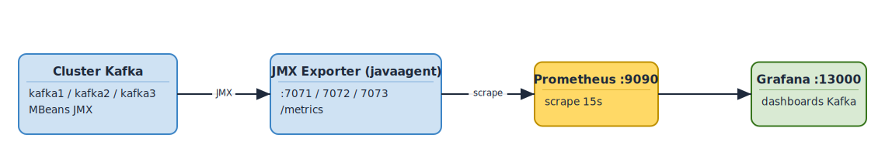
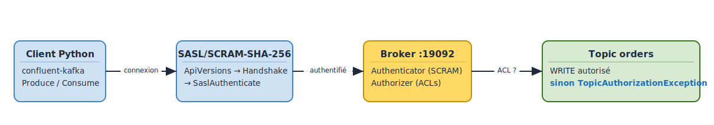

# Lab L8 — Ops & Sécurité : Prometheus, Grafana, SASL/SCRAM, ACLs
**Durée** : 2h
**Stack** : Docker, Kafka KRaft, Prometheus, Grafana, SASL/SCRAM, kafka-acls, Python (confluent-kafka)

> **Cours associé** : M6.6 — Observabilité (1ʳᵉ passe, focus Prometheus/Grafana/JMX), puis M8.x — Kafka en production (2ᵉ passe, focus sécurité SASL/TLS/ACL). La stack observabilité décrite en M6.6 correspond directement à ce lab.

## Objectifs

- Comprendre les **métriques clés** Kafka (broker, producer, consumer) et leurs seuils opérationnels.
- Lire un **dashboard Grafana** et identifier les signaux d'alerte.
- Activer **SASL/SCRAM-SHA-256** sur un cluster Kafka KRaft (brokers et inter-broker).
- Définir des **ACLs par utilisateur** (admin, producer, consumer) avec `kafka-acls`.
- Tester l'authentification et l'autorisation depuis un **client Python** (`confluent-kafka`).
- Comprendre les limites de SASL sans TLS et les pistes pour la production.

## Prérequis

- Lab L1 terminé (cluster Kafka non sécurisé démarré, JMX exporter en place, Prometheus + Grafana opérationnels).
- Python 3.10+ avec `confluent-kafka` installé : `pip install confluent-kafka==2.3.0`.
- Ports libres pour la stack sécurisée : `19092 19093 19094` (brokers EXTERNAL SASL), `17071 17072 17073` (JMX exporter).
- `make`, `curl`, `jq`, `docker compose v2`.

## Architecture — Stack observabilité (Partie 1)

<!-- mermaid-source
%%{init: {'theme':'base', 'themeVariables': {'primaryColor':'#1F2937','primaryTextColor':'#F9FAFB','primaryBorderColor':'#374151','lineColor':'#6366F1','fontFamily':'Inter, system-ui, sans-serif','fontSize':'14px'}}}%%
flowchart LR
    subgraph CLUSTER["Cluster Kafka KRaft (lab L1)"]
        K1[kafka1<br/>:9092]
        K2[kafka2<br/>:9093]
        K3[kafka3<br/>:9094]
    end

    subgraph JMX["JMX Prometheus Exporter (javaagent)"]
        J1[:7071/metrics]
        J2[:7072/metrics]
        J3[:7073/metrics]
    end

    K1 --&gt;|MBeans JMX| J1
    K2 --&gt;|MBeans JMX| J2
    K3 --&gt;|MBeans JMX| J3

    PROM[Prometheus<br/>:9090<br/>scrape 15s]
    J1 --&gt; PROM
    J2 --&gt; PROM
    J3 --&gt; PROM

    GRAF[Grafana<br/>:13000]
    PROM --&gt; GRAF

    USER[Data Engineer]
    USER --&gt; GRAF
    USER --&gt; PROM

    classDef kafka fill:#0EAA47,stroke:#0E7C32,color:#fff,stroke-width:2px
    classDef exporter fill:#F59E0B,stroke:#B45309,color:#fff,stroke-width:2px
    classDef monitor fill:#EC4899,stroke:#BE185D,color:#fff,stroke-width:2px
    classDef user fill:#3B82F6,stroke:#1E40AF,color:#fff,stroke-width:2px
    class K1,K2,K3 kafka
    class J1,J2,J3 exporter
    class PROM,GRAF monitor
    class USER user
-->

[Source Excalidraw](../../figures/L8/01.excalidraw)

## Architecture — Stack sécurité (Partie 2)

<!-- mermaid-source
%%{init: {'theme':'base', 'themeVariables': {'primaryColor':'#1F2937','primaryTextColor':'#F9FAFB','primaryBorderColor':'#374151','lineColor':'#6366F1','fontFamily':'Inter, system-ui, sans-serif','fontSize':'14px'}}}%%
flowchart LR
    CLI[Client Python<br/>confluent-kafka]

    subgraph HANDSHAKE["1. SASL/SCRAM-SHA-256"]
        H1[ApiVersionsRequest]
        H2[SaslHandshakeRequest]
        H3[SaslAuthenticate<br/>SCRAM messages]
    end

    subgraph BROKER["Broker Kafka SASL_PLAINTEXT :19092"]
        AUTH[Authenticator<br/>SCRAM credentials<br/>dans __consumer_offsets]
        ACL[Authorizer<br/>StandardAuthorizer<br/>ACLs dans metadata]
        TOPIC[(orders<br/>topic)]
    end

    CLI --&gt;|"Produce / Consume"| H1
    H1 --&gt; H2
    H2 --&gt; H3
    H3 --&gt;|user authentifié| AUTH
    AUTH --&gt;|principal: User:producer-app| ACL
    ACL --&gt;|"WRITE orders ?"| TOPIC

    DENIED[(Refus<br/>TopicAuthorizationException)]
    ACL -.->|"non autorisé"| DENIED

    classDef cli fill:#3B82F6,stroke:#1E40AF,color:#fff,stroke-width:2px
    classDef hs fill:#F59E0B,stroke:#B45309,color:#fff,stroke-width:2px
    classDef br fill:#0EAA47,stroke:#0E7C32,color:#fff,stroke-width:2px
    classDef topic fill:#10B981,stroke:#047857,color:#fff,stroke-width:2px
    classDef denied fill:#EF4444,stroke:#991B1B,color:#fff,stroke-width:2px
    class CLI cli
    class H1,H2,H3 hs
    class AUTH,ACL br
    class TOPIC topic
    class DENIED denied
-->

[Source Excalidraw](../../figures/L8/02.excalidraw)

---

# Partie 1 — Observabilité (1h)

## Étape 1 — Vérifier que JMX exporter expose les métriques

La stack du lab L1 (cluster `kafka1/2/3`) doit être démarrée. Vérifier que chaque broker expose `/metrics` au format Prometheus :

```bash
for p in 7071 7072 7073; do
  echo "--- broker port $p ---"
  curl -fsS http://localhost:$p/metrics | grep -E "^kafka_server_brokertopicmetrics_(messagesinpersec|bytesinpersec)" | head -3
done
```

Tu dois obtenir des compteurs `kafka_server_brokertopicmetrics_messagesinpersec_total` et `kafka_server_brokertopicmetrics_bytesinpersec_total` par topic.

> **Comment ça marche ?** L'agent `jmx_prometheus_javaagent.jar` est chargé via `-javaagent:` dans `KAFKA_OPTS`. Il lit les **MBeans JMX** du broker (`kafka.server`, `kafka.network`, `kafka.controller`, `java.lang`...) et les transforme en métriques Prometheus selon les règles `docker/jmx/kafka-jmx-exporter.yml`.

## Étape 2 — Vérifier que Prometheus scrape les 3 brokers

Ouvrir `http://localhost:9090/targets`. Tu dois voir le job **`kafka-brokers`** avec 3 targets `UP` (`kafka1:7071`, `kafka2:7071`, `kafka3:7071`).

Tester une requête PromQL dans `http://localhost:9090/graph` :

```promql
sum by (topic) (rate(kafka_server_brokertopicmetrics_messagesinpersec_total[1m]))
```

(Pour l'instant ce sera vide tant qu'aucun trafic n'est généré ; voir Étape 5.)

## Étape 3 — Ouvrir Grafana et vérifier les dashboards

Ouvrir `http://localhost:13000` (login `admin/admin`, ou en mode anonyme Viewer).

Dans le dossier **Formation Kafka**, trois dashboards principaux sont déjà provisionnés :

- `Kafka Cluster` — vue cluster (brokers, ISR, controllers, throughput).
- `Kafka Connect` — workers, tasks, lag.
- `Kafka Learning Dashboard` — vue pédagogique à garder ouverte pendant les labs.

Ouvrir d'abord `Kafka Learning Dashboard`, puis passer à `Kafka Cluster` pour les détails broker. Les captures recommandées sont décrites dans Observabilité des labs.

## Étape 4 — Métriques clés à connaître

| Métrique | Mesure | Seuil critique | Action si dépassé |
|---|---|---|---|
| `kafka_server_replicamanager_underreplicatedpartitions` | Partitions où un follower est sorti de l'ISR | **> 0** sur > 1 min | Identifier le broker en retard, vérifier disque/réseau/GC |
| `kafka_controller_kafkacontroller_activecontrollercount` | Controllers actifs (KRaft : 1 leader, 0 sur les autres voters) | Somme cluster ≠ 1 | Split-brain : redémarrer le quorum, vérifier le metadata log |
| `kafka_server_replicamanager_isrshrinkspersec` | Fréquence des shrinks d'ISR | Hausse soudaine | Broker instable : GC long, réseau perdu, IO saturée |
| `kafka_network_requestmetrics_requesthandleravgidlepercent` | % de temps où les threads I/O sont idle | **< 30%** soutenu | Augmenter `num.io.threads`, réduire la charge ou scaler |
| `kafka_network_requestmetrics_networkprocessoravgidlepercent` | % idle des threads réseau | **< 30%** soutenu | Augmenter `num.network.threads`, vérifier la bande passante |
| `kafka_server_brokertopicmetrics_bytesinpersec` / `bytesoutpersec` | Throughput par topic | Pic anormal vs baseline | Tracer le producer/consumer responsable |
| Consumer lag (via `kafka-consumer-groups` ou Burrow) | Retard d'un groupe sur la fin du log | > SLA métier (ex : 10 000 msg) | Vérifier consommateurs lents, scaler le groupe |
| `jvm_memory_heap_used_bytes` | Heap broker | > 80% du `-Xmx` | Augmenter heap, ou réduire `log.flush.interval` |
| `jvm_gc_collection_time_ms` | Temps cumulé en GC | Pause > 500 ms | Tuner GC (G1), réduire la heap si fragmentation |

> **Bonnes pratiques métriques producer (côté client)** :
> - `record-error-rate` > 0 → producer en erreur (récup ou perte selon `acks`).
> - `request-latency-avg` > 100 ms → broker lent ou réseau saturé.
> - `record-send-rate` baisse soudaine → backpressure (broker sature, queue producer pleine).
>
> **Bonnes pratiques métriques consumer (côté client)** :
> - `records-lag-max` qui croît linéairement → consumer ne suit pas le débit producer.
> - `commit-latency-avg` > 50 ms → broker `__consumer_offsets` lent.
> - `fetch-rate` qui s'effondre → rebalancing en cours.

## Étape 5 — Provoquer un incident et observer

Générer du trafic et arrêter `kafka2` pour observer les conséquences en direct :

```bash
# Depuis labs/L8-ops-security
make traffic-on        # produit 1k msg/s sur le topic events.demo (fond)
make break-broker      # docker compose stop kafka2
```

Aller sur le dashboard `Kafka Cluster` et observer pendant 60 s :

1. **Active controller count** : la somme reste à 1 (le leader bascule si `kafka2` était leader, sinon rien).
2. **Under-replicated partitions** : monte rapidement (toutes les partitions où kafka2 était dans l'ISR perdent un replica).
3. **ISR shrinks/sec** : pic.
4. **Bytes in** : reste stable (les producers continuent en `acks=all` car `min.insync.replicas=2` est respecté avec 2 replicas restants).

Restaurer :

```bash
make restore-broker    # docker compose start kafka2
make traffic-off
```

Au bout d'environ 30 s, l'ISR se reconstruit, `under-replicated` retombe à 0.

## Étape 6 — Configurer une alerte Prometheus

Le fichier `prometheus/rules.yml` fourni définit 3 alertes essentielles :

```yaml
groups:
  - name: kafka-critical
    interval: 30s
    rules:
      - alert: KafkaUnderReplicatedPartitions
        expr: sum(kafka_server_replicamanager_underreplicatedpartitions) > 0
        for: 2m
        labels:
          severity: critical
        annotations:
          summary: "URP > 0 depuis 2 min"
          description: "Au moins une partition est sous-répliquée. Vérifier les brokers."

      - alert: KafkaActiveControllerCountInvalid
        expr: sum(kafka_controller_kafkacontroller_activecontrollercount) != 1
        for: 1m
        labels:
          severity: critical
        annotations:
          summary: "Controllers actifs != 1"
          description: "Split-brain potentiel ou aucun controller élu."

      - alert: KafkaBrokerDown
        expr: up{job="kafka-brokers"} == 0
        for: 1m
        labels:
          severity: critical
        annotations:
          summary: "Broker {{ $labels.instance }} indisponible"
```

Pour activer ces règles, monter le fichier dans Prometheus (édition de `docker/prometheus/prometheus.yml`) — voir `make alerts-install` qui copie automatiquement le fichier et recharge Prometheus via l'API admin :

```bash
make alerts-install
curl -s http://localhost:9090/api/v1/rules | jq '.data.groups[].rules[].name'
```

Tester l'alerte `KafkaBrokerDown` : `make break-broker` puis attendre 1 min, l'alerte passe `firing` dans `http://localhost:9090/alerts`.

> En production, brancher Alertmanager sur Prometheus pour router vers Slack/PagerDuty/email avec une politique de regroupement et silence.

---

# Partie 2 — Sécurité (1h)

## Étape 7 — Démarrer la stack sécurisée

Cette stack est **séparée** du cluster L1 (réseau Docker isolé, ports `19092/3/4`). Elle ne touche pas au cluster plaintext utilisé par les autres labs.

```bash
make sec-up            # docker compose -f docker-compose.security.yml up -d
make sec-ps            # vérifier que kafka-sec-1/2/3 sont running
```

Le démarrage prend environ 30 s (formatage du metadata log avec un user `admin` SCRAM pré-créé via `--add-scram`, puis bootstrap KRaft).

## Étape 8 — Configurer SASL/SCRAM côté broker (lecture)

Ouvrir `docker-compose.security.yml`. Points clés (à comprendre, déjà configurés) :

- **Listeners** :
  ```
  KAFKA_LISTENERS: INTERNAL://0.0.0.0:29092,CONTROLLER://0.0.0.0:29093,EXTERNAL://0.0.0.0:19092
  KAFKA_LISTENER_SECURITY_PROTOCOL_MAP: CONTROLLER:PLAINTEXT,INTERNAL:PLAINTEXT,EXTERNAL:SASL_PLAINTEXT
  KAFKA_INTER_BROKER_LISTENER_NAME: INTERNAL
  KAFKA_SASL_ENABLED_MECHANISMS: SCRAM-SHA-256
  ```
- **Le SASL/SCRAM est appliqué uniquement sur le listener client `EXTERNAL`** (`:19092-19094`). Le trafic inter-broker et controller reste en `PLAINTEXT` sur le réseau Docker interne (réseau de confiance).
- **Pourquoi pas SASL/SCRAM sur le controller ?** C'est un piège KRaft : les credentials SCRAM sont stockés **dans le metadata log**, lequel n'existe qu'une fois le quorum de controllers formé… qui aurait justement besoin de ces credentials pour s'authentifier. Œuf-et-poule → le quorum ne se forme jamais (`invalid credentials` en boucle). On sécurise donc le périmètre **exposé** (les clients) et on fait confiance au réseau interne. En production, on durcit l'interne avec **mTLS** (cf. § « limites de SASL_PLAINTEXT »), pas avec SCRAM.
- **JAAS inline** (listener EXTERNAL) :
  ```
  KAFKA_LISTENER_NAME_EXTERNAL_SCRAM_SHA_256_SASL_JAAS_CONFIG: |
    org.apache.kafka.common.security.scram.ScramLoginModule required
    username="admin" password="admin-secret";
  ```
- **Authorizer** : `KAFKA_AUTHORIZER_CLASS_NAME: org.apache.kafka.metadata.authorizer.StandardAuthorizer` (KRaft, ACLs stockées dans le metadata log).
- **Super users** : `KAFKA_SUPER_USERS: User:admin;User:ANONYMOUS` (admin bypasse les ACLs ; `ANONYMOUS` correspond au trafic interne PLAINTEXT, donc inter-broker/controller autorisés).
- **Bootstrap user** : `admin` créé via `kafka-storage format ... --add-scram 'SCRAM-SHA-256=[name=admin,password=admin-secret]'` — utilisé pour s'authentifier sur le listener EXTERNAL et administrer les ACLs.

> **KRaft + sécurité** : on authentifie le **périmètre client** (listener EXTERNAL, SASL/SCRAM + ACL) et on garde l'inter-broker/controller en PLAINTEXT sur réseau de confiance. Mettre du SCRAM sur le controller casse le bootstrap du quorum (credentials dans un metadata log pas encore formé).

## Étape 9 — Créer 3 utilisateurs SCRAM

Le user `admin` existe déjà (créé au bootstrap). On crée maintenant `producer-app` et `consumer-app` via `kafka-configs` (qui modifie les credentials SCRAM stockés dans le metadata log) :

```bash
make users        # exécute users/setup_users.sh
```

Le script lance, depuis le conteneur `kafka-sec-1` (authentifié en `admin`) :

```bash
kafka-configs --bootstrap-server kafka-sec-1:29092 \
  --command-config /etc/kafka/admin.properties \
  --alter --add-config 'SCRAM-SHA-256=[password=producer-secret]' \
  --entity-type users --entity-name producer-app

kafka-configs --bootstrap-server kafka-sec-1:29092 \
  --command-config /etc/kafka/admin.properties \
  --alter --add-config 'SCRAM-SHA-256=[password=consumer-secret]' \
  --entity-type users --entity-name consumer-app
```

Vérifier :

```bash
docker exec kafka-sec-1 kafka-configs \
  --bootstrap-server kafka-sec-1:29092 \
  --command-config /etc/kafka/admin.properties \
  --describe --entity-type users
```

Tu dois voir 3 utilisateurs avec un credential `SCRAM-SHA-256` (le hash, pas le mot de passe en clair).

## Étape 10 — Définir les ACLs

Modèle souhaité :

| User | Topic `orders` | Consumer group `analytics-*` | Cluster |
|---|---|---|---|
| `admin` | super-user, tout | tout | tout |
| `producer-app` | WRITE, DESCRIBE | — | IDEMPOTENT_WRITE (pour `acks=all` idempotent) |
| `consumer-app` | READ, DESCRIBE | READ (groupe `analytics-*`) | — |

Appliquer :

```bash
make acls         # exécute acls/setup_acls.sh
```

Le script crée le topic `orders` (3p, RF=3) puis :

```bash
# Producer : WRITE + DESCRIBE sur orders, IDEMPOTENT_WRITE cluster
kafka-acls ... --add --allow-principal User:producer-app \
  --operation Write --operation Describe --topic orders
kafka-acls ... --add --allow-principal User:producer-app \
  --operation IdempotentWrite --cluster

# Consumer : READ + DESCRIBE sur orders, READ sur les groupes analytics-*
kafka-acls ... --add --allow-principal User:consumer-app \
  --operation Read --operation Describe --topic orders
kafka-acls ... --add --allow-principal User:consumer-app \
  --operation Read --group "analytics-" --resource-pattern-type prefixed
```

Vérifier :

```bash
docker exec kafka-sec-1 kafka-acls \
  --bootstrap-server kafka-sec-1:29092 \
  --command-config /etc/kafka/admin.properties \
  --list
```

## Étape 11 — Tester depuis Python

```bash
pip install confluent-kafka==2.3.0
python clients/producer_sasl.py        # produit 10 messages sur orders en tant que producer-app
python clients/consumer_sasl.py        # consomme orders en tant que consumer-app, group analytics-team-a
```

Sortie attendue (consumer) :

```
[consumer-app] reçu offset=0 key=order-0 value={"id":0,"amount":42}
[consumer-app] reçu offset=1 key=order-1 value={"id":1,"amount":42}
...
```

Côté Python, la config SASL minimale est :

```python
{
  "bootstrap.servers": "localhost:19092",
  "security.protocol": "SASL_PLAINTEXT",
  "sasl.mechanism": "SCRAM-SHA-256",
  "sasl.username": "producer-app",
  "sasl.password": "producer-secret",
}
```

## Étape 12 — Tenter un accès refusé

```bash
python clients/producer_unauthorized.py
```

Ce script tente :

1. Un **consumer** avec les credentials `producer-app` → `KafkaError: Topic authorization failed` (pas de READ).
2. Un **producer** avec les credentials `consumer-app` → `KafkaError: Topic authorization failed` (pas de WRITE).

Inspecter les logs broker côté autorisation :

```bash
docker logs kafka-sec-1 2>&1 | grep -i "authoriz\|denied" | tail -20
```

Tu dois voir des lignes du type :

```
Principal = User:consumer-app is Denied operation = Write from host = ...
on resource = Topic:LITERAL:orders
```

## Note importante — limites de SASL_PLAINTEXT

**SASL/SCRAM sans TLS ne chiffre pas le trafic.** Le mot de passe est protégé par le challenge SCRAM (le hash ne transite pas en clair, mais le mécanisme reste vulnérable au MITM s'il n'y a pas TLS, ainsi qu'au sniffing du **payload** des messages).

En production :

- **SASL_SSL** : SCRAM ou OAUTHBEARER au-dessus de TLS (chiffrement + auth).
- **mTLS** (mutual TLS) : authentification par certificat client, sans SCRAM. Nécessite une PKI interne.
- **OAuth/OIDC** : `OAUTHBEARER` avec un IdP (Keycloak, Okta, Auth0). Tokens à courte durée, pas de mot de passe partagé.
- **Audit** : activer `authorizer.logger.name` en `INFO` pour tracer les refus, archiver dans un SIEM.

Voir `solutions/L8-ops-security/clients/producer_ssl.py` (challenge) pour la configuration SASL_SSL avec keystore PEM.

## Validation

- [ ] Les 3 brokers de la stack L1 exposent `/metrics` sur `7071/2/3`.
- [ ] Prometheus scrape les 3 brokers (`kafka-brokers` job UP × 3).
- [ ] Dashboard `Kafka Cluster` accessible et alimenté.
- [ ] Dashboard `Kafka Learning Dashboard` accessible et alimenté.
- [ ] L'arrêt de `kafka2` provoque une montée d'URP visible dans Grafana, et la production reste fonctionnelle.
- [ ] Au moins une règle Prometheus (`KafkaBrokerDown`) passe `firing` lors d'un incident provoqué.
- [ ] Stack sécurisée `docker-compose.security.yml` démarrée, 3 brokers `kafka-sec-1/2/3` healthy.
- [ ] 3 utilisateurs SCRAM créés (`admin`, `producer-app`, `consumer-app`).
- [ ] ACLs appliquées et listées par `kafka-acls --list`.
- [ ] `producer_sasl.py` produit 10 messages, `consumer_sasl.py` les consomme.
- [ ] `producer_unauthorized.py` provoque un `Topic authorization failed`.

## Pour aller plus loin

- **SASL_SSL avec keystore** : générer une CA et des certs serveur, activer `SASL_SSL` au lieu de `SASL_PLAINTEXT`. Voir `solutions/L8-ops-security/clients/producer_ssl.py` et `solutions/L8-ops-security/certs/`.
- **mTLS** : remplacer SCRAM par l'authentification par certificat client (`ssl.client.auth=required`, principal = CN du cert).
- **OAuth/OIDC** : configurer `OAUTHBEARER` avec Keycloak comme IdP. Idéal pour les environnements multi-équipes (groupes mappés depuis l'IdP).
- **Audit log** : consommer `__consumer_offsets` et tracer les commits offset par groupe (voir `solutions/L8-ops-security/audit_log/audit_consumer.py`).
- **Alertes avancées** : ajouter `request-latency p99`, `consumer lag`, `partition leader skew` (voir `solutions/L8-ops-security/prometheus/rules-advanced.yml`).
- **Quotas** : limiter le débit par user (`producer_byte_rate`, `consumer_byte_rate`) avec `kafka-configs --entity-type users`.
- **Burrow** ou **Kafka Lag Exporter** : exporter le consumer lag de manière fiable et indépendante du client.

## Dépannage

| Symptôme | Diagnostic | Action |
|---|---|---|
| Targets Prometheus `DOWN` | JMX exporter non démarré ou port mal mappé | `curl localhost:7071/metrics` ; vérifier `KAFKA_OPTS` |
| Dashboard vide | Aucune métrique scrapée OU mauvaise datasource | Vérifier `Connections > Datasources > Prometheus` dans Grafana |
| `kafka-sec-X` reste `starting` | Cluster ID divergent ou bootstrap user manquant | `make sec-clean` (perte des données SASL), `make sec-up` |
| `SaslAuthenticationException: Authentication failed` | Mot de passe incorrect ou user non créé | Re-jouer `make users` ; vérifier `kafka-configs --describe --entity-type users` |
| `Topic authorization failed` côté producer authentifié | ACL manquante | `kafka-acls --list` ; ré-jouer `make acls` |
| `Unknown topic or partition` | Topic `orders` pas créé OU pas d'ACL DESCRIBE | `make acls` recrée le topic, vérifier `kafka-topics --list` (avec creds admin) |
| Le quorum controller ne se forme pas (`invalid credentials` en boucle) | SASL/SCRAM activé sur le listener CONTROLLER (deadlock bootstrap) | Garder `CONTROLLER:PLAINTEXT,INTERNAL:PLAINTEXT` ; SASL uniquement sur EXTERNAL. Sinon `make sec-clean` (volume corrompu) |
| `make break-broker` ne déclenche pas l'alerte | Règles non chargées | `make alerts-install` puis `curl localhost:9090/-/reload` |

À l'issue de ce lab, tu maîtrises le tryptique opérationnel **observer / alerter / sécuriser** d'un cluster Kafka. Étapes suivantes en production : TLS partout, OAuth, Cruise Control pour le rééquilibrage, et un SIEM pour l'audit.
